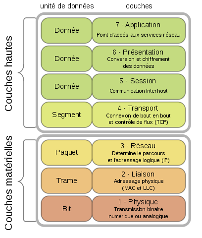
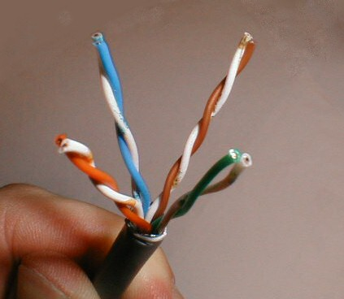
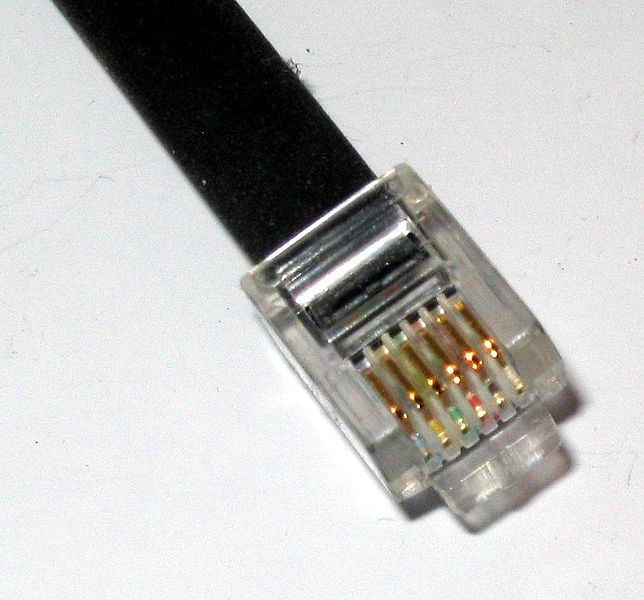
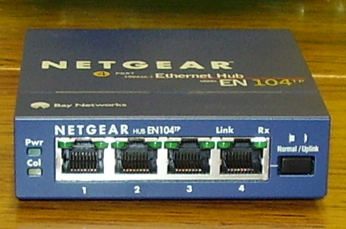
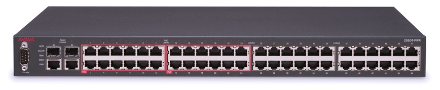

# Administration réseau

Un réseau informatique permet à des machines connectées entre elles de communiquer et d'échanger des données.

## Types de réseaux

Il existe plusieurs types de réseaux :

- LAN (Local Area Network)
- WAN (Wide Area Network)
- MAN (Metropolitan Area Network)
- Internet

Les LAN sont les plus petits réseaux informatiques qu'il est possible de construire.

Les WAN sont des réseaux qui relient des LAN.

Internet est souvent appelé « le réseau des réseaux ».
En effet, les différents opérateurs qui fournissent un accès à internet (en France Orange, Free, etc) construisent des WAN privés.
Mais il existent encore bien d'autres WAN privés proposés par d'autre opérateurs en France ou à l'étranger.
Internet est le réseau qui relie tout ces WAN.

### FAI (Fournisseur d'Accès à Internet)

Personne n'est propriétaire d'Internet et tout le monde peut devenir fournisseur d'accès à Internet.

Pour plus de détails, voir [FDN - Fournisseur d'Accès à Internet associatif depuis 1992](https://www.fdn.fr/).

## Intranets et extranets

Un intranet est un réseau dont les services ne sont accessibles que aux personnes faisant partie de l'organisation qui a mis en place le réseau.

Par exemple, pour une banque, l'application de gestion des contacts client.

Un extranet est un réseau dont les services sont rendus accessibles aux personnes extérieures à l'organisation qui a mis en place le réseau.

Par exemple, pour une banque, l'application de gestion de compte bancaire mis à disposition des clients.

## VPN (Virtual private network)

C'est un système qui permet à un utilisateur d'être connecté à un réseau privé (celui d'une entreprise par exemple) comme s'il était physiquement sur place, alors qu'en réalité il y est connecté en passant par internet.

## Modèle OSI (Open Systems Interconnection)

Le modèle OSI est un modèle théorique de communication entre ordinateurs.

La norme OSI, proposée par l'Organisation Internationale de Normalisation (ISO en anglais), n'a pas réussi à s'imposer.
Néanmoins, il est intéressant de connaître le modèle OSI car il permet comprendre l'organisation des protocoles de communication réseau.

Par exemple, voici ce que donne l'analyse du réseau Internet selon le modèle OSI :

| n° | Couche       | Norme                                  |
|----|--------------|----------------------------------------|
| 7  | Application  | Web                                    |
| 6  | Présentation | HTML / XML                             |
| 5  | Session      | HTTP / HTTPS                           |
| 4  | Transport    | TCP                                    |
| 3  | Réseau       | IP                                     |
| 2  | Liaison      | Ethernet / xDSL                        |
| 1  | Physique     | RJ45 / RJ11 / RJ12. Câbles Cat. 5 et + |

Pour plus de détails, voir [Modèle OSI — Wikipédia](https://fr.wikipedia.org/wiki/Mod%C3%A8le_OSI).

## Composants physiques

### Câble

On parle parfois de câble ethernet ou de câble RJ45.
Il s'agit d'un abus de langage pour parler de câble CAT5e ou CAT6 avec un connecteur RJ45.
Mais franchement, n'embêtez pas vos collègues avec ce genre de détail, svp.

Pour des raisons d'efficacité de transmission du signal, on utilise des câbles composés de fil de cuivre en paires torsadées.

Un câble de quatre paires torsadées :

Les terminaisons de ces paires s'appellent des brins, il y en a donc huit (quatre paires).
Pour améliorer la qualité de transmission du signal, les câbles sont « blindés » contre les champs électromagnétiques.
Plus ce blindage est important, plus la qualité du signal est meilleure.
Les câbles sont classés en catégorie en fonction de la qualité du blindage.

Pour des réseaux informatiques relativement simples, les catégories suivantes sont suffisantes :

- la catégorie 5 (CAT5) est maintenant obsolète mais elle peut être utilisée dans le cadre de réseaux domestiques de petite taille ; cette catégorie a une bande passante de 100 MHz et un débit de 100 Mbit/s
- la catégorie 5 enhanced (CAT5e) est utilisée dans le cadre de réseaux professionnels ; cette catégorie a une bande passante de 100 MHz et un débit de 1 000 Mbit/s
- la catégorie 6 (CAT6) est aussi utilisé dans le cadre de réseaux professionnels ; sont avantage par rapport au cat5e est de présenter une résistance plus faible et donc d'être plus économe en énergie lorsqu'on utilise du PoE (Power over Ethernet) ; cette catégorie a une bande passante de 250 MHz et un débit de 10 000 Mbit/s

### Connecteur

La plupart du temps, ce sont des connecteurs de type RJ45 qui sont utilisés.

Un connecteur RJ45 :

À ne pas confondre avec les connecteur RJ11 qui est utilisé exclusivement pour le téléphone.

Un connecteur RJ11 :

Relier un câble et un connecteur est appelé « sertir un câble ».
Il existe des pinces permettant d'effectuer cette opération de façon simplifiées.

Les brins du câble doivent être reliés dans un ordre précis pour que la communication réseau fonctionne.
Heureusement il y a des codes couleurs qui permettent de s'y retrouver plus facilement.

Conseil : les prises RJ45 ont été conçues pour être compatibles avec les prise RJ11. Du coup il est possible de brancher un téléphone sur une prise RJ45 et d'utiliser le câble comme ralllonge téléphonique.
Autrement dit, lors de la conception du réseau téléphonique, plutôt que de déployer des câbles avec des connecteurs RJ11, il vaut mieux déployer des câbles avec des connecteurs RJ45 qui peuvent être utilisé indiféremment pour le téléphone ou l'informatique.
Le coût de la main d'œuvre du déploiement est le même, seul le prix des câbles et des connecteurs varie un peu.

Pour une démonstration de sertissage, voir cette vidéo : [Comment monter, sertir et tester un connecteur RJ45 sur câble réseau CAT5/CAT6 - YouTube](https://www.youtube.com/watch?v=ig9s6SjyWIk).

### PoE (Power over Ethernet)

Ce système permet d'alimenter une machine connectée au réseau en utilisant les câbles réseau au lieu de mettre en place un réseau électrique en plus.

La norme permet de pouvoir faire passer 48 V.

Attention donc lors de la manipulation de ces câbles et veillez à bien les protéger et les isoler pour éviter tout court-circuit.

### Fibre optique

C'est un type câble dont le fil est composé de verre ou de plastique.
Cette matière transparente permet de faire passer de la lumière.
C'est donc la lumière qui transporte l'information à la place des impulsions électriques comme dans un câble en cuivre.

La fibre optique possède des particularités qui en font un excellent choix pour déployer un réseau informatique :

- un très haut débit par rapport aux câbles de cuivre
- une atténuation du signal beaucoup moins forte que celle des câbles de cuivre
- une insensibilité aux interférences électromagnétiques

Mais son inconvénient majeur est son prix.
Les câbles à fibre optique et le matériel qui est capable d'en tirer profit sont plus chers que les câbles en cuivre et le matériel associé.

### Hub

Un hub ou un concentrateur est une appareil qui permet de relier plusieurs machines entre elles et de créer un réseau.

Chaque prise qui permet de connecter une machine est appelée un port.

Un hub quatre ports Netgear :

Attention : le hub souffre de sévères limitations.
Un conseil : évitez d'en acquérir un, investissez plutôt dans un switch.

#### Segment de réseau

Quand plusieurs machines sont connectées entre elles avec un hub, on dit que ces machines partagent le même segment de réseau.

Au niveau éléctrique, toutes les machines sont connectées à un même « bus » ([Bus informatique — Wikipédia](https://fr.wikipedia.org/wiki/Bus_informatique)).
Dès qu'une machine transmet un signal, toutes les machines connectées à ce bus peuvent écouter le signal.
Si une autre machine veut aussi transmettre un signal, elle doit attendre que le bus soit disponible.
Si deux machines essaient de transmettre un signal en même temps sur le bus, on dit qu'il y a une collision.
Bien sûr, lorsqu'il y a collision, le signal ne peut pas être correctement acheminé au destinataire.

Le problème, c'est que plus il y a de machines connectées au même bus, et plus il y a de chances qu'une collision arrive.
Heureusement, le switch permet de corriger ce problème.

#### Switch

Un switch ou commutateur réseau ressemble à un hub.
Mais à la différence du hub, en se servant de l'adresse IP et de l'adresse MAC, le switch est capable de savoir sur quel port chaque machine est connectée.

Quand une machine transmet un signal, le switch achemine le signal vers le port de destination seulement au lieu de le diffuser (braodcast) sur tous les ports comme le hub.

Au niveau électrique, le switch créé plusieurs segments de réseau qui sont donc isolés entre eux.
Ceci a pour effet de réduire le risque de collision.

Un switch Avaya 50 ports :

### Routeur

Un routeur est un appareil qui permet de connecter deux réseau qui ont des plans d'adressages différents.
Typiquement, le routeur est utilisé pour relier un réseau LAN et un réseau WAN.

Le routeur est capable de transmettre les paquets de données d'un réseau à l'autre mais sa fonction est en fait d'isoler les réseaux LAN des réseaux WAN afin de permettre la construction de réseaux plus larges.

La box de votre fournisseur d'accès à Internet est équipée d'un routeur (et d'un modem).
C'est pourquoi la « box » est parfois aussi appelée « routeur ».

Un routeur avec accès Wi-Fi US Robotics :

### Bridge (pont)

Un bridge est un appareil qui permet de connecter deux réseau qui ont des plans d'adressages identiques mais des technologies différentes (fibre optique, cuivre) ou des implantations géographiques différentes.

Cet appareil fait le même travail qu'un switch mais en plus il est capable de convertir les signaux si les deux réseaux utilisent des technologies différentes.

### Wireless access point / Access point (point d'accès sans fil / point d'accès)

C'est le Wi-Fi !

Cet appareil, relié à réseau filaire, permet à des machines équipées d'antennes Wi-Fi de communiquer avec d'autres machines comme si elles étaient connectées par câble.

Il y a plusieurs normes qui permettent de communiquer à des débits plus ou moins importants :

- 802.11b : 11 Mbit/s
- 802.11g : 54 Mbit/s
- 802.11n : 72 Mbit/s

Attention : vérifiez bien la capacité de débit du port filaire aussi.
Si vous avez trois machines qui communiquent à 54 Mbit/s, cela s'additionne et le port filaire débite du 162 Mbit/s.
Un port 1 000 Mbit/s pour le port filaire est donc bienvenu.

### CPL (Courants Porteurs en Ligne)

Dans certaines situations, il est compliqué voir impossible de mettre en place un réseau informatique filaire ou sans fil.
Le CPL permet d'utiliser le réseau électrique déjà en place pour transporter des données.

Des boîtiers CPL sont branchés d'une part à une prise électrique et d'autre part à un appareil ethernet (carte réseau d'un ordinateur, access point, routeur, etc).

Les boîtiers « écoutent » les communications sur le réseau électrique et se comportent comme un hub.

C'est ce type d'appareil qui permet de mettre en réseau les boxes en deux parties (routeur et media center) des différents FAI.

#### Sécurité

Attention : le protocole de sécurisation WEP (Wired Equivalent Privacy) est totalement obsolète, ne l'utilisez pas.

Utilisez WPA2 (Wi-Fi Protected Access 2), ou sinon WPA.

Conseil : en mode « WPA personnel », vous devez choisir une phrase secrète assez longue (et non un mot de passe court) pour assurer un niveau de sécurité suffisant.

### Modem

> Modem : modulateur-démodulateur

Un modem est un appareil capable de transformer des signaux analogiques en signaux digitaux et vice versa pour permettre à une machine de communiquer via un réseau analogique.

En général, les modems sont utilisés pour connecter des réseaux informatiques à un réseau téléphonique.

#### Modem 56 K

Ce sont a bercé une génération d'internautes !

[Dial Up Modem Handshake Sound - Spectrogram - YouTube](https://www.youtube.com/watch?v=vvr9AMWEU-c)

## Protocoles de communication

Un protocole de communication une « langue » commune parlée par deux machines ou programmes.

Il existe une multitude de protocoles qui sont autant de solutions à des problèmes différents.

### Ethernet

Ethernet est un protocole qui permet à plusieurs machines de communiquer alors qu'elle se partagent un unique « bus ».

Le principe est d'obliger les machines à attendre que le bus soit disponible avant d'émettre un signal et de prévoir à l'avance comment elles doivent se comporter si elles essayent d'émettre un signal au même moment (et donc de provoquer une collision).

### TCP/IP (Transmission Control Protocol/Internet protocol)

TCP et IP sont les deux protocoles de communication qui font fonctionner Internet.

IP permet au machines de s'identifier et de s'adresser à d'autres machines.
Il est important de noter que ce protocole de communication est capable de choisir un chemin pour transmettre des paquets de données et surtout de changer de chemin s'il y a un problème de communication.

TCP permet de découper les données à transmettre en petits paquets de données et de les adresser au service auquel on veut faire appel.
Côté récepteur, un système de contrôle permet de s'assurer que les données sont intègres.

Rappelons que ces protocoles ont été inventés aux Étas-Unis par la DARPA (Defense Advanced Research Projects Agency) dans le cadre de la Guerre froide et de l'éventualité d'une guerre nucléaire...

#### Épuisement des adresses IPv4

Le protocole IPv4 est encore largement utilisé aujourd'hui, par rapport à son succésseur IPv6.

L'attribution des adresses publiques en IPv4 est aujourd'hui assurée par un organisme américain nommé IANA (Internet Assigned Numbers Authority).

En France, c'est l'AFNIC (Association française pour le nommage Internet en coopération) qui joue ce rôle.

Or il reste de moins en moins d'adresses disponibles.
La conséquence est qu'avec IPv4 il ne sera bientôt plus possible de connecter de nouvelles machines à Internet.

#### IPv4

Les adresses de type IPv4 sont constituées de quatre nombres pouvant avoir une valeur allant de `0` à `255`.

Autrement dit, toutes les adresses publiques doivent être comprises entre `0.0.0.0` et `255.255.255.255`.

Un peu de calculs.

> `(2 ^ 8) ^ 4 = 256 ^ 4 = 4 294 967 296`

Cela permet tout de même d'avoir plus de 4 milliard d'adresses.

#### IPv6

Les adresses de type IPv6 ont été inventées pour solutioner le problème de pénurie d'adresses IPv4.
L'IPv6 permet d'avoir plus de `3,4 * 10 ^ 38` (340 sextillions) adresses différentes.

La très grande quantité d'adresses possibles rend inutile l'usage de la technique du NAT (Network Adress Translation, traduction d'adresse internet) indispensable avec IPv4.

Les adresses de type IPv6 sont constituées de huit nombres de deux octets, écrits en hexadécimal, pouvant avoir une valeur allant de `0000` à `ffff`, chacun séparés par un symbole `:` « deux points ».

Par exemple :

> `fc00:0db8:0000:85a3:0000:0000:ac1f:8001`

Afin d'avoir des adresse plus courtes, les zéros qui précèdent les valeurs peuvent-être omis.
Et les zéros consécutifs peuvent être remplacé par le symbole `::` « paire de deux-points ».

L'adresse précédente devient :

> `fc00:db8:0:85a3::ac1f:8001`

### DHCP (Dynamic Host Configuration Protocol)

Système d'attribution automatique d'adresses IP.
Surtout utile avec IPv4.

Les DHCP bas de gamme gère parfois mal le renouvellement du bail.
Le mieux est alors de redémarrer le serveur DHCP.

### DNS (Domain Name System)

Le DNS est l'équivalent d'un annuaire téléphonique mais pour des noms de domaine.
On lui fournit un nom de domaine, et le serveur DNS renvoit une adresse IP.

FQDN (Fully Qualified Domain Name, nom de domaine pleinement qualifié)

Par exemple :

> `www.example.org`

TLD (Top Level Domain, domaine de premier niveau)

Le TLD de `www.example.org` est `.org`.

### VLAN (Virtual Local Area Network)

### xDSL et ADSL

### VoIP

## Architecture

### Adresse MAC (Media Access Control)

C'est une adresse unique que possède toutes les cartes réseaux.
Cette adresse permet d'identifier une machine.

Elle peut s'avérer utile si vous voulez « black lister » ou « white lister » l'accès au réseau à une machine.

### Adresses IP

Une adresse IP est constituée :

- d'une adresse du réseau
- d'une adresse de la machine
- d'un masque de sous réseau

On dit de deux machines qu'elles sont sur le même réseau si elle sont reliées par un switch (ou un hub) et si elles possèdent la même plage d'adresse, c-à-d une portion d'adresse IP commune.

Par exemple, deux machines ayant respectivement les adresses (IPv4) `192.168.0.14` et `192.168.0.37` sont sur le même réseau car elles partagent la plage d'adresse `192.168.0.x`).
Mais deux machines ayant respectivement les adresses (IPv4) `192.168.0.14` et `172.16.0.37` ne sont pas sur le même réseau, même physiquement connectées au même switch, car elles ont chacune une plage d'adresse différentes, `192.168.0.x` et `172.16.0.x`.

#### Adressage IPv4

Certaines adresses sont réservées à un usage particulier (RFC 573511) :

| Bloc (adresse de début et taille CIDR) | (adresse de fin correspondante) | Usage                            | Référence              |
|----------------------------------------|---------------------------------|----------------------------------|------------------------|
| 0.0.0.0/8                              | 0.255.255.255                   | Ce réseau                        | RFC 573511, RFC 112212 |
| 10.0.0.0/8                             | 10.255.255.255                  | Adresses privées                 | RFC 191813             |
| 127.0.0.0/8                            | 127.255.255.255                 | Adresses de bouclage (localhost) | RFC 112212             |
| 172.16.0.0/12                          | 172.31.255.255                  | Adresses privées                 | RFC 191813             |
| 192.168.0.0/16                         | 192.168.255.255                 | Adresses privées                 | RFC 191813             |
| 255.255.255.255/32                     | 255.255.255.255                 | broadcast limité                 | RFC 91922              |

Source : [IPv4](https://fr.wikipedia.org/wiki/Adresse_IP#IPv4)

#### Adressage IPv6

Les plages d'adresses IPv6 suivantes sont réservées (RFC 515624) :

| Bloc           | Usage                                    | Référence  |
|----------------|------------------------------------------|------------|
| ::/128         | Adresse non spécifiée                    | RFC 429125 |
| ::1/128        | Adresse de bouclage                      | RFC 429125 |
| ::ffff:0:0/96  | Adresse IPv6 mappant IPv4                | RFC 429125 |
| 0100::/64      | sollicitation de trou noir               | RFC 666626 |
| 2000::/3       | Adresses unicast routables sur Internet  | RFC 358727 |
| 2001::/32      | Teredo                                   | RFC 438028 |
| 2001:2::/48    | Tests de performance                     | RFC 518029 |
| 2001:10::/28   | Orchid                                   | RFC 484330 |
| 2001:db8::/32  | documentation                            | RFC 384931 |
| 2002::/16      | 6to4                                     | RFC 305632 |
| fc00::/7       | Adresses locales uniques                 | RFC 419333 |
| fe80::/10      | Adresses locales lien                    | RFC 429125 |
| ff00::/8       | Adresses multicast                       | RFC 429125 |

Source : [IPv6](https://fr.wikipedia.org/wiki/Adresse_IP#IPv6)

#### Adresses statiques

Adapté pour les serveurs.

#### Adresses dynamiques

Adapté pour les postes de travail ou tout autre type de machine qui se comporte comme un client sur le réseau.

### Firewall

Un firewall permet de faire :

- un blocage de port
- une redirection de port vers une machine spéicifique

#### DMZ (DeMilitarized Zone)

La DMZ est une configuration spéciale du firewall qui permet d'isoler une partie des machines d'un réseau local et en même temps de les exposer à internet.
Ceci permet de mettre à disposition des internautes des services utiles tout en s'assurant que ces machines ne peuvent pas accéder au réseau local si jamais elles un pirate en prend le contrôle.

Les services suivants sont couramment mis à disposition dans une DMZ :

- serveur Web
- serveur de Mail
- serveur FTP
- serveur VoIP

## Applications courantes

- FTP (File Transfer Protocol), port 21
- SSH (Secure Shell), port 22
- Telnet, port 23
- SMTP (Simple Mail Transfer Protocol), port 25
- HTTP (Hypertext Transfer Protocol), port 80
- POP3 (Post Office Protocol, version 3), port 110
- IRC (Internet Relay Chat), port 194
- IMAP (Internet Message Access Protocol), port 143, port 220
- HTTPS (Hypertext Transfer Protocol over TLS/SSL), port 443
- Microsoft Active Directory, port 445
- Microsoft SMB (Server Message Block), port 445
- SMTPS (Authenticated SMTP[10] over TLS/SSL), port 465
- IPP (Internet Printing Protocol), port 631
- CUPS (Common Unix Printing System), port 631
- IMAPS (Internet Message Access Protocol over TLS/SSL), port 993
- IRCS (Internet Relay Chat over TLS/SSL), port 994
- POP3S (Post Office Protocol 3 over TLS/SSL), port 995

Voir [Liste de ports logiciels — Wikipédia](https://fr.wikipedia.org/wiki/Liste_de_ports_logiciels) pour plus de détails.

## Doc

### Réseaux

- [Internet — Wikipédia](https://fr.wikipedia.org/wiki/Internet)
- [Réseau local — Wikipédia](https://fr.wikipedia.org/wiki/R%C3%A9seau_local)
- [Réseau étendu — Wikipédia](https://fr.wikipedia.org/wiki/R%C3%A9seau_%C3%A9tendu)
- [Réseau métropolitain — Wikipédia](https://fr.wikipedia.org/wiki/R%C3%A9seau_m%C3%A9tropolitain)
- [Extranet — Wikipédia](https://fr.wikipedia.org/wiki/Extranet)
- [Intranet — Wikipédia](https://fr.wikipedia.org/wiki/Intranet)
- [Réseau privé virtuel — Wikipédia](https://fr.wikipedia.org/wiki/R%C3%A9seau_priv%C3%A9_virtuel)
- [Épuisement des adresses IPv4 — Wikipédia](https://fr.wikipedia.org/wiki/%C3%89puisement_des_adresses_IPv4)
- [Transition d'IPv4 vers IPv6 — Wikipédia](https://fr.wikipedia.org/wiki/Transition_d%27IPv4_vers_IPv6)

### Théorie

- [Modèle OSI — Wikipédia](https://fr.wikipedia.org/wiki/Mod%C3%A8le_OSI)
- [Bus informatique — Wikipédia](https://fr.wikipedia.org/wiki/Bus_informatique)
- [Segment de réseau — Wikipédia](https://fr.wikipedia.org/wiki/Segment_de_r%C3%A9seau)
- [Domaine de diffusion — Wikipédia](https://fr.wikipedia.org/wiki/Domaine_de_diffusion)
- [Domaine de collision — Wikipédia](https://fr.wikipedia.org/wiki/Domaine_de_collision)
- [Wired Equivalent Privacy — Wikipédia](https://fr.wikipedia.org/wiki/Wired_Equivalent_Privacy)
- [Wi-Fi Protected Access — Wikipédia](https://fr.wikipedia.org/wiki/Wi-Fi_Protected_Access)
- [Network address translation — Wikipédia](https://fr.wikipedia.org/wiki/Network_address_translation)
- [Zone démilitarisée (informatique) — Wikipédia](https://fr.wikipedia.org/wiki/Zone_d%C3%A9militaris%C3%A9e_%28informatique%29)
- [Digital subscriber line — Wikipédia](https://fr.wikipedia.org/wiki/Digital_subscriber_line)
- [ADSL — Wikipédia](https://fr.wikipedia.org/wiki/ADSL)

### Matériel

- [RJ45 — Wikipédia](https://fr.wikipedia.org/wiki/RJ45)
- [RJ11 — Wikipédia](https://fr.wikipedia.org/wiki/RJ11)
- [Paire torsadée — Wikipédia](https://fr.wikipedia.org/wiki/Paire_torsad%C3%A9e)
- [Comment monter, sertir et tester un connecteur RJ45 sur câble réseau CAT5/CAT6 - YouTube](https://www.youtube.com/watch?v=ig9s6SjyWIk)
- [Alimentation électrique par câble Ethernet — Wikipédia](https://fr.wikipedia.org/wiki/Alimentation_%C3%A9lectrique_par_c%C3%A2ble_Ethernet)
- [Adresse MAC — Wikipédia](https://fr.wikipedia.org/wiki/Adresse_MAC)
- [Hub Ethernet — Wikipédia](https://fr.wikipedia.org/wiki/Hub_Ethernet)
- [Commutateur réseau — Wikipédia](https://fr.wikipedia.org/wiki/Commutateur_r%C3%A9seau)
- [Routeur — Wikipédia](https://fr.wikipedia.org/wiki/Routeur)
- [Pont (réseau) — Wikipédia](https://fr.wikipedia.org/wiki/Pont_(r%C3%A9seau))
- [Point d'accès sans fil — Wikipédia](https://fr.wikipedia.org/wiki/Point_d%27acc%C3%A8s_sans_fil)
- [Wireless access point - Wikipedia](https://en.wikipedia.org/wiki/Wireless_access_point)

### Protocoles

- [Ethernet — Wikipédia](https://fr.wikipedia.org/wiki/Ethernet)
- [Transmission Control Protocol — Wikipédia](https://fr.wikipedia.org/wiki/Transmission_Control_Protocol)
- [Internet Protocol — Wikipédia](https://fr.wikipedia.org/wiki/Internet_Protocol)
- [Adresse IP — Wikipédia](https://fr.wikipedia.org/wiki/Adresse_IP)
- [IPv4 — Wikipédia](https://fr.wikipedia.org/wiki/IPv4)
- [IPv6 — Wikipédia](https://fr.wikipedia.org/wiki/IPv6)
- [Dynamic Host Configuration Protocol — Wikipédia](https://fr.wikipedia.org/wiki/Dynamic_Host_Configuration_Protocol)
- [Domain Name System — Wikipédia](https://fr.wikipedia.org/wiki/Domain_Name_System)

### Services et numéros de port utilisés

- [Liste de ports logiciels — Wikipédia](https://fr.wikipedia.org/wiki/Liste_de_ports_logiciels)

### Sécurité

- [Phrase secrète — Wikipédia](https://fr.wikipedia.org/wiki/Phrase_secr%C3%A8te)

### Téléphonie

- [Voix sur IP — Wikipédia](https://fr.wikipedia.org/wiki/Voix_sur_IP)

### Institutions

- [Defense Advanced Research Projects Agency — Wikipédia](https://fr.wikipedia.org/wiki/Defense_Advanced_Research_Projects_Agency)
- [Internet Assigned Numbers Authority — Wikipédia](https://fr.wikipedia.org/wiki/Internet_Assigned_Numbers_Authority)
- [Association française pour le nommage Internet en coopération — Wikipédia](https://fr.wikipedia.org/wiki/Association_fran%C3%A7aise_pour_le_nommage_Internet_en_coop%C3%A9ration)
