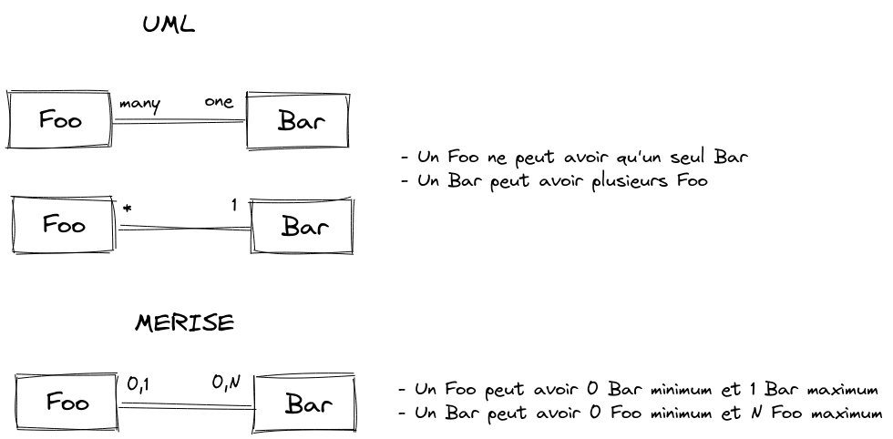
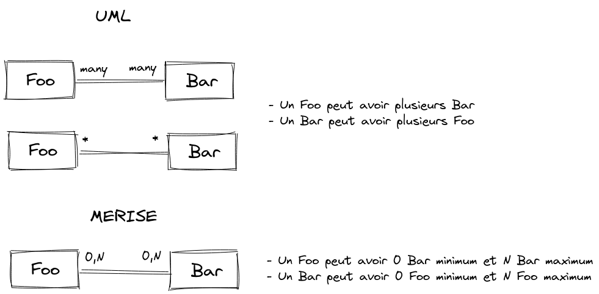

# Doctrine ORM

Un ORM est un programme qui permet d'utiliser une BDD relationnelle comme si elle stockait les données sous la forme d'objets.
Cela permet de faciliter l'utilisation d'une BDD quand on fait de la POO.

## À savoir

### Entité

Une entité est une classe qui représente un objet qui sera stocké en BDD.
On dit que les entités sont notre modèle de données.

### Repository et Entity Manager

Le Repository est un composant qui s'occupe de toutes les opérations en lecture :

- read

L'Entity Manager est un composant qui s'occupe de toutes les opérations en écriture :

- create
- update
- delete

## Entité

### Exemple d'entité

    <?php
    // src/Entity/Foo.php

    namespace App\Entity;

    use Doctrine\ORM\Mapping as ORM;

    /**
     * Foo
     *
     * @ORM\Entity()
     */
    class Foo
    {
        /**
         * @ORM\Id
         * @ORM\GeneratedValue()
         * @ORM\Column(type="integer")
         */
        private $id;

        /**
         * @var string
         *
         * @ORM\Column(type="string", length=100)
         */
        private $name;

        /**
         * @var integer
         *
         * @ORM\Column(type="integer")
         */
        private $quantity;

        public function getId(): ?int
        {
            return $this->id;
        }

        public function getName(): ?string
        {
            return $this->name;
        }

        public function setName(string $name): self
        {
            $this->name = $name;

            return $this;
        }

        public function getQuantity(): ?int
        {
            return $this->quantity;
        }

        public function setQuantity(int $quantity): self
        {
            $this->quantity = $quantity;

            return $this;
        }
    }

Note : si votre application Symfony se trouve dans un bundle (`AppBundle` par exemple), vous devez probalement corriger le `namespace` pour obtenir : `namespace AppBundle\Entity;`

### Relations cardinales entre entités

Il existe quatre types de relations cardinales entre entités :

- `one to one`
- `one to many`
- `many to one`
- `many to many`

Voir [code-style.md](code-style.md) pour les questions de nommage de variable au singulier ou au pluriel.

### Relation `one to many`

Une entité `Foo` ne peut avoir plusieurs entités `Bar`.
Mais une entité `Bar` ne peut avoir qu'une seule entité `Foo`.

Exemple : une entreprise peut avoir plusieurs voitures de fonction.
Et une voiture de fonction ne peut être rattaché qu'à une seule entreprise.

La relation du point de vue de `Foo` :

    <?php
    // src/Entity/Foo.php

    namespace App\Entity;

    use Doctrine\Common\Collections\ArrayCollection;
    use Doctrine\Common\Collections\Collection;
    use Doctrine\ORM\Mapping as ORM;

    /**
     * @ORM\Entity()
     */
    class Foo
    {
        /**
         * @ORM\Id()
         * @ORM\GeneratedValue()
         * @ORM\Column(type="integer")
         */
        private $id;

        /**
         * @ORM\OneToMany(targetEntity="App\Entity\Bar", mappedBy="foo")
         */
        private $bars;

        public function __construct()
        {
            $this->bars = new ArrayCollection();
        }

        public function getId(): ?int
        {
            return $this->id;
        }

        /**
         * @return Collection|Bar[]
         */
        public function getBars(): Collection
        {
            return $this->bars;
        }

        public function addBar(Bar $bar): self
        {
            if (!$this->bars->contains($bar)) {
                $this->bars[] = $bar;
                $bar->setFoo($this);
            }

            return $this;
        }

        public function removeBar(Bar $bar): self
        {
            if ($this->bars->contains($bar)) {
                $this->bars->removeElement($bar);
                // set the owning side to null (unless already changed)
                if ($bar->getFoo() === $this) {
                    $bar->setFoo(null);
                }
            }

            return $this;
        }
    }

La relation du point de vue de `Bar` :

    <?php
    // src/Entity/Bar.php

    namespace App\Entity;

    use Doctrine\ORM\Mapping as ORM;

    /**
     * @ORM\Entity()
     */
    class Bar
    {
        /**
         * @ORM\Id()
         * @ORM\GeneratedValue()
         * @ORM\Column(type="integer")
         */
        private $id;

        /**
         * @ORM\ManyToOne(targetEntity="App\Entity\Foo", inversedBy="bars")
         */
        private $foo;

        public function getId(): ?int
        {
            return $this->id;
        }

        public function getFoo(): ?Foo
        {
            return $this->foo;
        }

        public function setFoo(?Foo $foo): self
        {
            $this->foo = $foo;

            return $this;
        }
    }

### Relation `many to one`

Une entité `Foo` ne peut avoir qu'une seule entité `Bar`.
Mais une entité `Bar` peut avoir plusieurs entités `Foo`.

C'est la même relation qu'un `many to one` mais du point de vue de l'autre entité.

Exemple : une voiture de fonction ne peut être rattaché qu'à une seule entreprise.
Mais une entreprise peut avoir plusieurs voitures de fonction.

La relation du point de vue de `Foo` :

    <?php
    // src/Entity/Foo.php

    namespace App\Entity;

    use Doctrine\ORM\Mapping as ORM;

    /**
     * @ORM\Entity()
     */
    class Foo
    {
        /**
        * @ORM\Id()
        * @ORM\GeneratedValue()
        * @ORM\Column(type="integer")
        */
        private $id;

        /**
         * @ORM\ManyToOne(targetEntity="App\Entity\Bar", inversedBy="foos")
         */
        private $bar;

        public function getId(): ?int
        {
            return $this->id;
        }

        public function getBar(): ?Bar
        {
            return $this->bar;
        }

        public function setBar(?Bar $bar): self
        {
            $this->bar = $bar;

            return $this;
        }
    }

La relation du point de vue de `Bar` :

    <?php
    // src/Entity/Bar.php

    namespace App\Entity;

    use Doctrine\Common\Collections\ArrayCollection;
    use Doctrine\Common\Collections\Collection;
    use Doctrine\ORM\Mapping as ORM;

    /**
     * @ORM\Entity()
     */
    class Bar
    {
        /**
         * @ORM\Id()
         * @ORM\GeneratedValue()
         * @ORM\Column(type="integer")
         */
        private $id;

        /**
         * @ORM\OneToMany(targetEntity="App\Entity\Foo", mappedBy="bar")
         */
        private $foos;

        public function __construct()
        {
            $this->foos = new ArrayCollection();
        }

        public function getId(): ?int
        {
            return $this->id;
        }

        /**
         * @return Collection|Foo[]
         */
        public function getFoos(): Collection
        {
            return $this->foos;
        }

        public function addFoo(Foo $foo): self
        {
            if (!$this->foos->contains($foo)) {
                $this->foos[] = $foo;
                $foo->setBar($this);
            }

            return $this;
        }

        public function removeFoo(Foo $foo): self
        {
            if ($this->foos->contains($foo)) {
                $this->foos->removeElement($foo);
                // set the owning side to null (unless already changed)
                if ($foo->getBar() === $this) {
                    $foo->setBar(null);
                }
            }

            return $this;
        }
    }

### Relation `many to many`

Une entité `Foo` peut avoir plusieurs entités `Baz`.
Et une entité `Baz` peut avoir plusieurs entités `Foo`.

Exemple : une voiture de fonction peut être réservée (successivement) par plusieurs salariés.
Et un salarié peut réserver (successivement) plusieurs voitures de fonction.

La relation du point de vue de `Foo` :

    <?php
    // src/Entity/Foo.php

    namespace App\Entity;

    use Doctrine\Common\Collections\ArrayCollection;
    use Doctrine\Common\Collections\Collection;
    use Doctrine\ORM\Mapping as ORM;

    /**
     * @ORM\Entity()
     */
    class Foo
    {
        /**
         * @ORM\Id()
         * @ORM\GeneratedValue()
         * @ORM\Column(type="integer")
         */
        private $id;

        /**
         * @ORM\ManyToMany(targetEntity="App\Entity\Bar", inversedBy="foos")
         */
        private $bars;

        public function __construct()
        {
            $this->bars = new ArrayCollection();
        }

        public function getId(): ?int
        {
            return $this->id;
        }

        /**
         * @return Collection|Bar[]
         */
        public function getBars(): Collection
        {
            return $this->bars;
        }

        public function addBar(Bar $bar): self
        {
            if (!$this->bars->contains($bar)) {
                $this->bars[] = $bar;
            }

            return $this;
        }

        public function removeBar(Bar $bar): self
        {
            if ($this->bars->contains($bar)) {
                $this->bars->removeElement($bar);
            }

            return $this;
        }
    }

La relation du point de vue de `Bar` :

    <?php
    // src/Entity/Bar.php

    namespace App\Entity;

    use Doctrine\Common\Collections\ArrayCollection;
    use Doctrine\Common\Collections\Collection;
    use Doctrine\ORM\Mapping as ORM;

    /**
     * @ORM\Entity()
     */
    class Bar
    {
        /**
         * @ORM\Id()
         * @ORM\GeneratedValue()
         * @ORM\Column(type="integer")
         */
        private $id;

        /**
         * @ORM\ManyToMany(targetEntity="App\Entity\Foo", mappedBy="bars")
         */
        private $foos;

        public function __construct()
        {
            $this->foos = new ArrayCollection();
        }

        public function getId(): ?int
        {
            return $this->id;
        }

        /**
         * @return Collection|Foo[]
         */
        public function getFoos(): Collection
        {
            return $this->foos;
        }

        public function addFoo(Foo $foo): self
        {
            if (!$this->foos->contains($foo)) {
                $this->foos[] = $foo;
                $foo->addBar($this);
            }

            return $this;
        }

        public function removeFoo(Foo $foo): self
        {
            if ($this->foos->contains($foo)) {
                $this->foos->removeElement($foo);
                $foo->removeBar($this);
            }

            return $this;
        }
    }

### Configuration de valeurs par défaut

Les valeurs par défaut sont définies dans le constructeur.

Par convention, le constructeur est toujours situé entre le dernier attribut (variable) et la première méthode (fonction).

Si l'on veut que la variable `quantity` de l'entité `Foo` soit initialisée avec l'année en cours par défaut, il faut ouvrir le fichier `src/Entity/Foo.php` et ajouter un constructeur ou le modifier pour obtenir :

    <?php
    // src/Entity/Foo.php

        // ...
        private $quantity;              // <= dernier attribut

        /**
         * Constructor
         */
        public function __construct()   // <= constructeur
        {
            $this->quantity = 42;
        }

        /**
         * Get id
         *
         * @return integer
         */
        public function getId() {       // <= première méthode

## Repository et Entity Manager

### Récupérer un ou des objets enregistrées

    <?php
    // src/Controller/FooController.php

    namespace App\Controller;

    // ...
    use App\Entity\Foo;
    // ...

        // instancie le repository de l'entité
        $repository = $em->getRepository(Foo::class);

        // récupère tous les objets
        $foos = $repository->findAll();

        // récupère un objet à partir de son id
        $foo = $repository->find($id);

        // récupère plusieurs objets à partir d'un critère
        $foo = $repository->findByQuantity(42);

        // récupère plusieurs objets à partir de plusieurs critères
        $foos = $repository->findBy([
            'name' => 'Foo bar baz',
            'quantity' => 42,
        ]);

        // récupère un objet à partir d'un critère
        $foo = $repository->findOneByName('Foo bar baz');

        // récupère un objet à partir de plusieurs critères
        $foo = $repository->findOneBy([
            'name' => 'Foo bar baz',
            'quantity' => 42,
        ]);

    // ...

Attention : si votre application Symfony se trouve dans un bundle, vous devez probalement corriger le `namespace` et le `use` pour obtenir : `namespace AppBundle\Controller;` `use AppBundle\Entity\Foo;`

### `ArrayCollection` ou la liste d'objets

Quand vous récupérez des objets à l'aides des méthodes `findAll()` ou `findBy()` par exemmple, vous récupérez un objet de la classe `ArrayCollection`.
La classe `ArrayCollection` est comme un tableau mais avec beaucoup plus de fonctionnalités.

Par exemple cette classe permet de vérifier si on objet est présent dans la liste, de savoir à quel indexe il se trouve, d'appliquer une fonction sur tous les objets de la liste, etc.

Voici des exmples d'utilisation :

    <?php
    // src/Controller/FooController.php

    namespace App\Controller;

    // ...
    use App\Entity\Foo;
    // ...

        // instancie le repository de l'entité Foo
        $repository = $em->getRepository(Foo::class);

        // récupère tous les objets
        // la variable $foos est un objet de la classe ArrayCollection
        $foos = $repository->findAll();

        // ajoute un nouvel objet de la classe Foo dans la liste
        $foo = new Foo();
        $foos->add($foo);

        // récupère le premier objet de la liste
        $first = $foos->first();

        // récupère le dernier objet de la liste
        $last = $foos->last();

        // vérifie s'il y a au moins un objet dont l'atribut `bar` est égal à 42
        $exists = $collection->exists(function($key, $value) {
            return $value->getBar() == 42;
        });

        if ($exists) {
          // il y a un objet dont l'attribut `bar` est égal à 42
        } else {
          // il n'y a aucun objet dont l'attribut `bar` est égal à 42
        }

        // recherche tous les objets dont l'attribut `baz` est inférieur à 123
        $filteredCollection = $foos->filter(function($element) {
            return $element->getBaz() < 123;
        });

        foreach ($filteredCollection as $element) {
          // tous les éléments de cette boucle ont un attribut `baz` inférieur à 123
        }

Pour en savoir plus, consultez la doc de la classe `ArrayCollection` : [Introduction - Doctrine Collections](https://www.doctrine-project.org/projects/doctrine-collections/en/current/index.html).

### Enregistrer une nouvelle entité

    // instanciation de l'Entity Manager
    $em = $this->getDoctrine()->getManager();

    // création d'un nouvelle entité
    $foo = new Foo();

    // affectation de valeur à l'entité
    $foo->setName('Foo bar baz');

    // enregistrement de l'entité
    $entityManager->persist($foo);
    $entityManager->flush();

### Mettre à jour une entité existante

    // instanciation de l'Entity Manager
    $em = $this->getDoctrine()->getManager();

    // instanciation du repository de l'entité
    $repository = $em->getRepository(Foo::class);

    // récupération d'une entité à partir de son id
    $foo = $repository->find($id);

    // modification de l'entité
    $foo->setName('Lorem ipsum');
    $foo->setQuantity(123);

    // enregistrement de l'entité
    $entityManager->flush();

## Récupérer les données d'une requête DQL

- `$query = $em->createQuery($dql)` créé une requête DQL (de type `SELECT`)

- `$query->getResult()` renvoit un tableau d'objets. Renvoit un tableau vide si aucun objet n'est trouvé.
- `$query->getSingleResult()` renvoit un objet. Si aucun objet ou plusieurs objets sont trouvés, une exception est levée.
- `$query->getOneOrNullResult()` renvoit un objet ou la valeur `null` si aucun objet n'est trouvé. Si plusieurs objets sont trouvés, une exception est levée.

- `$query->getScalarResult()` renvoit un tableau de valeurs scalaires (comme des `int`, des `float` ou des `string` par exemple). Renvoit un tableau vide si aucun objet n'est trouvé.
- `$query->getSingleScalarResult()` renvoit une valeur scalaire. Si aucune valeur ou plusieurs valeurs sont trouvées, une exception est levée.

## Doc

- [Doctrine Configuration Reference (DoctrineBundle) (Symfony 3.4 Docs)](https://symfony.com/doc/3.4/reference/configuration/doctrine.html)
- [Customizing the User Entity > Symfony Security: Beautiful Authentication, Powerful Authorization | SymfonyCasts](https://symfonycasts.com/screencast/symfony-security/user-entity#setting-doctrines-server-version).
- [Welcome to Doctrine 2 ORM's documentation! - Object Relational Mapper (ORM) - Doctrine](https://www.doctrine-project.org/projects/doctrine-orm/en/current/index.html)
- [Introduction - Doctrine Collections](https://www.doctrine-project.org/projects/doctrine-collections/en/current/index.html)
- [Association Mapping - Object Relational Mapper (ORM) - Doctrine](https://www.doctrine-project.org/projects/doctrine-orm/en/current/reference/association-mapping.html#association-mapping)
- [Doctrine Query Language - Object Relational Mapper (ORM) - Doctrine](https://www.doctrine-project.org/projects/doctrine-orm/en/current/reference/dql-doctrine-query-language.html)
- [Databases and the Doctrine ORM (Symfony 3.4 Docs)](https://symfony.com/doc/3.4/doctrine.html)
