# Google app password

Cette fiche vous montre comment créer un « app password », mot de passe
d'application.

## Les étapes

Rendez-vous dans l'onglet sécurité des paramètres de votre compte
Google : [Compte Google](https://myaccount.google.com/security).

Maintenant suivez les étapes.

Étape 1

Cliquez sur le lien « Mot de passe des applications ».

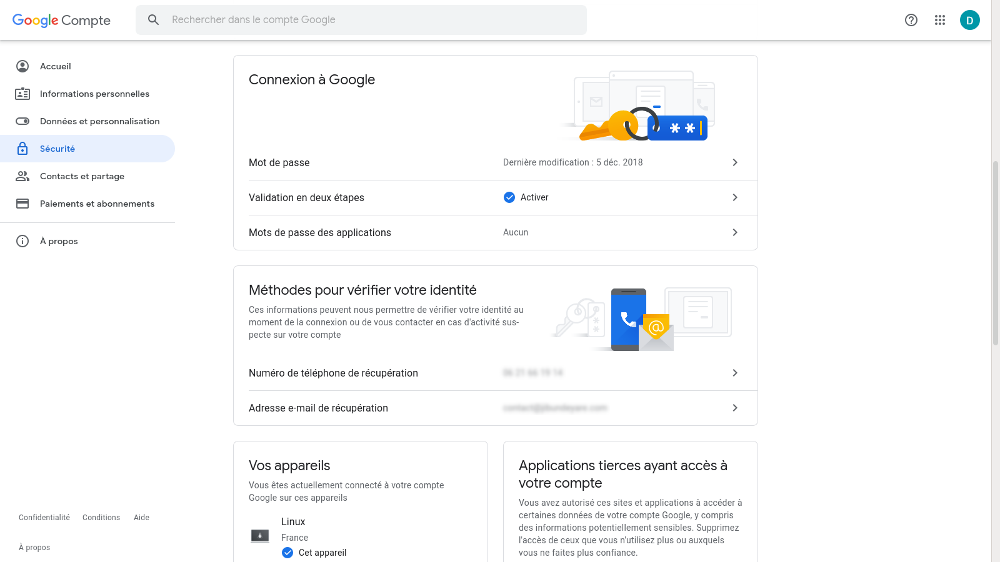

Étape 2

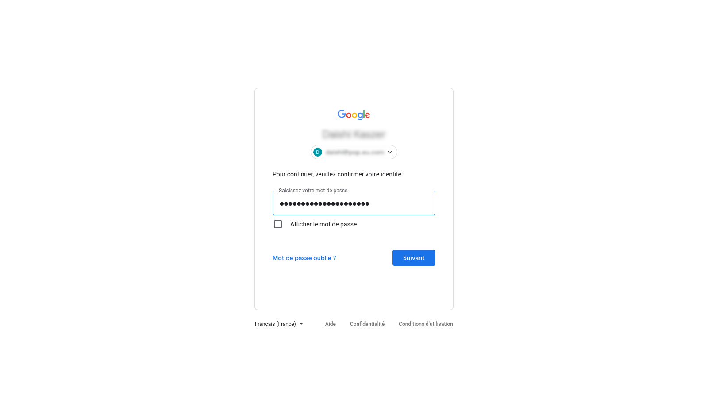

Étape 3

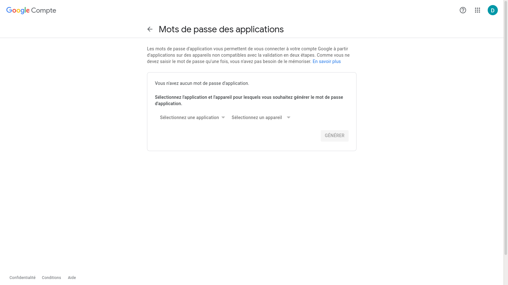

Étape 4

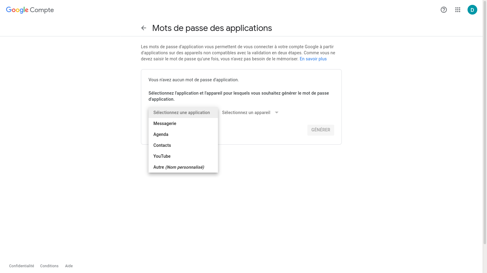

Étape 5

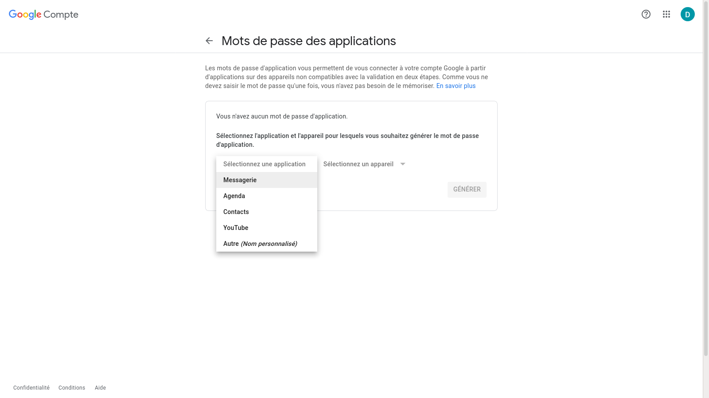

Étape 6

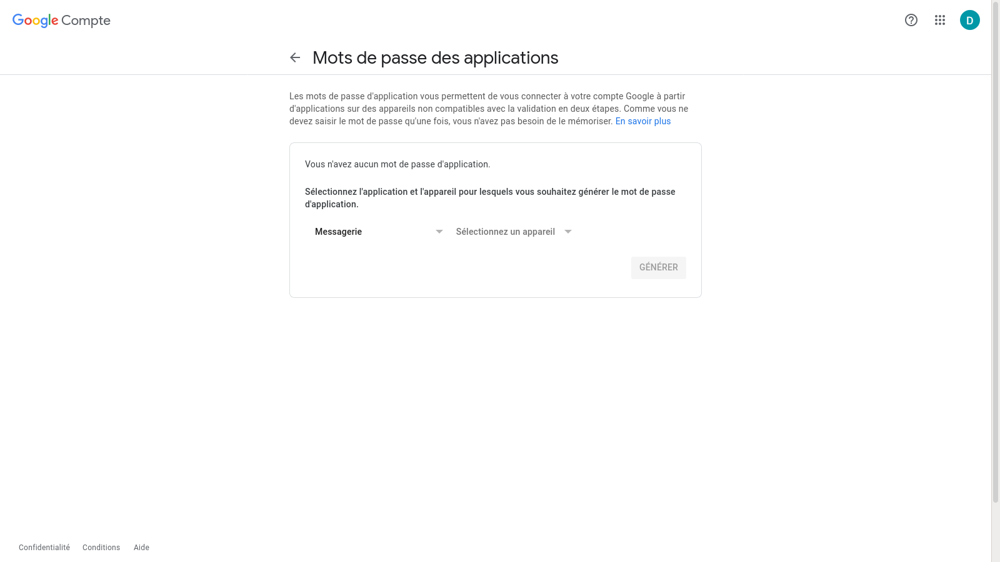

Étape 7

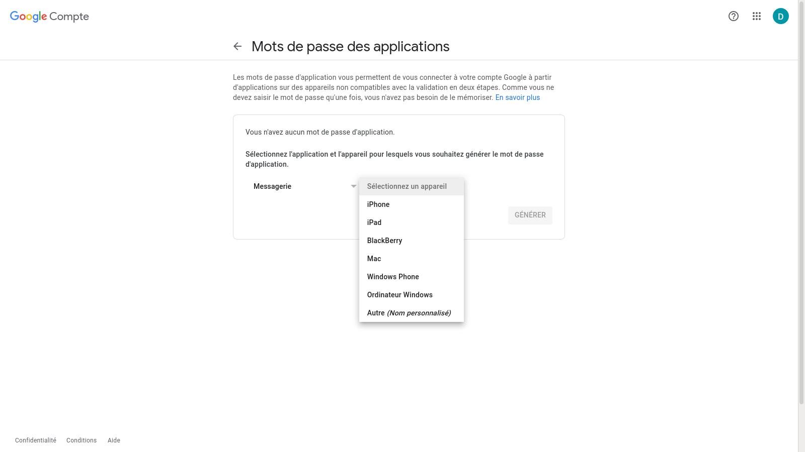

Étape 8

Étape 9

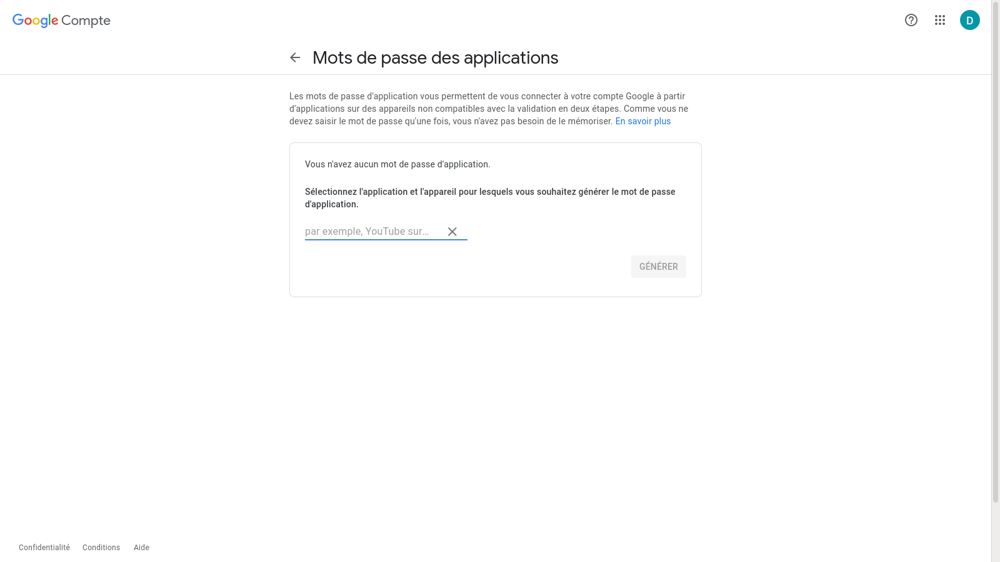

Étape 10

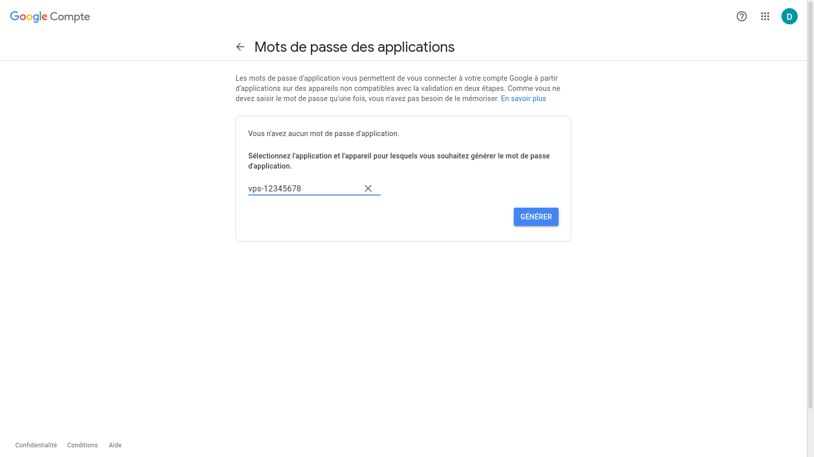

Étape 11

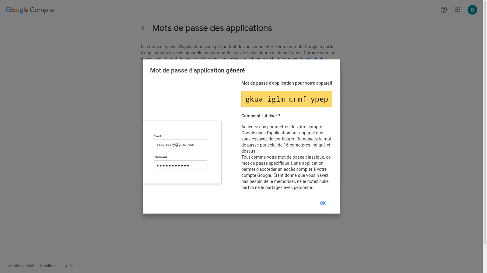

Étape 12

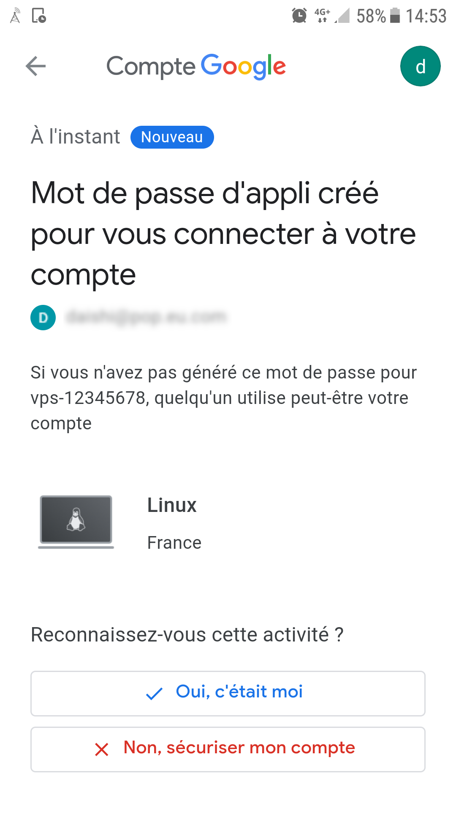

Étape 13

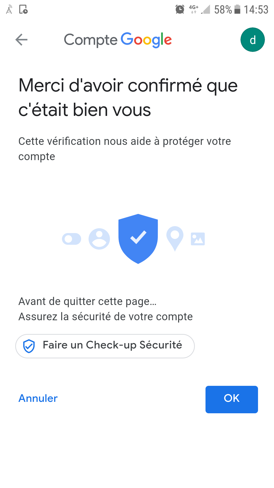

Étape 14

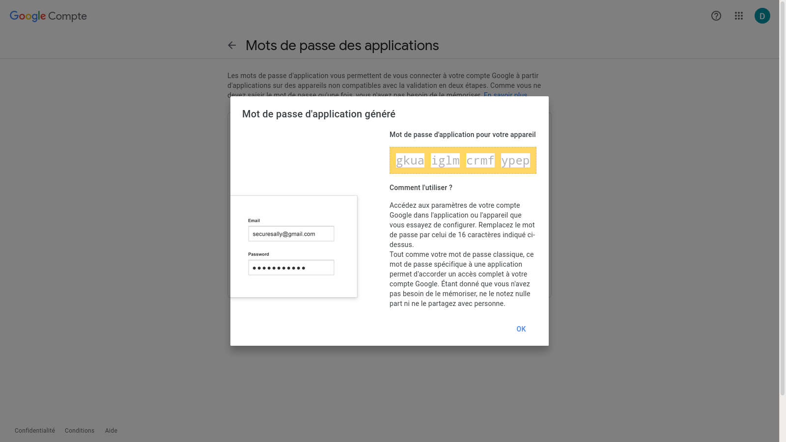

Étape 15

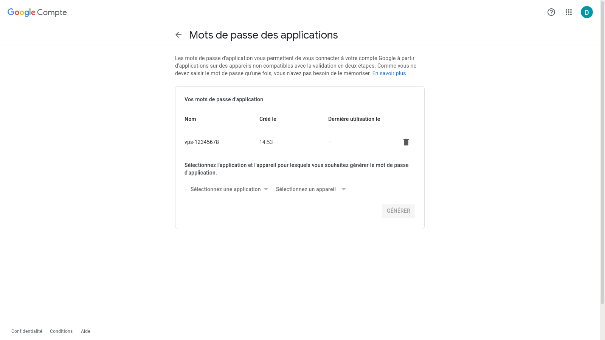

