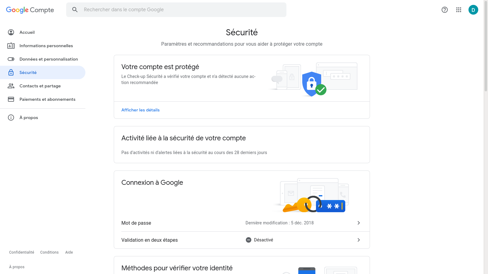
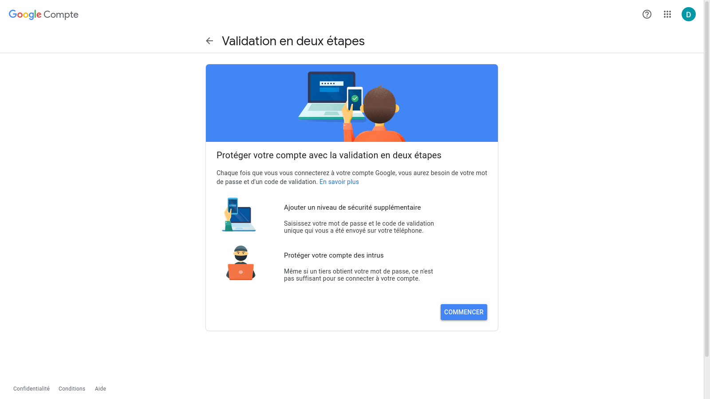
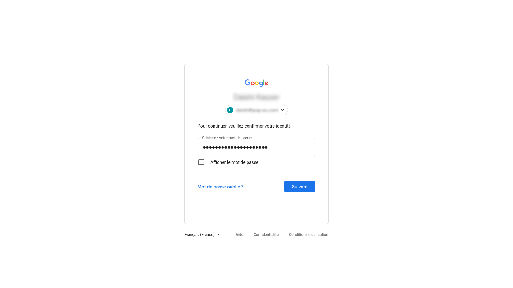
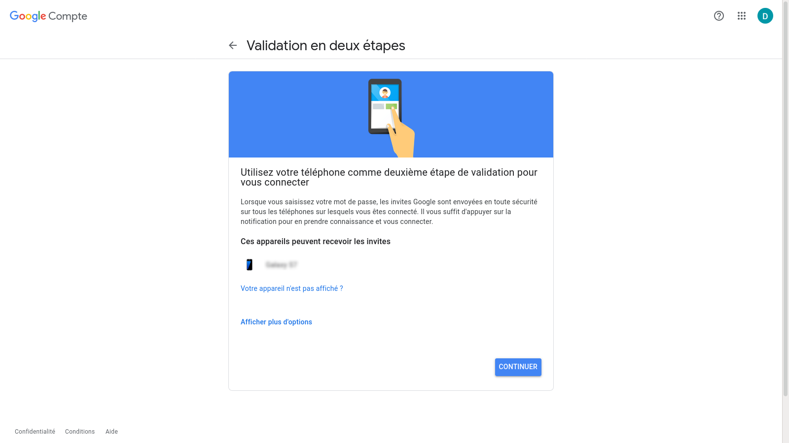
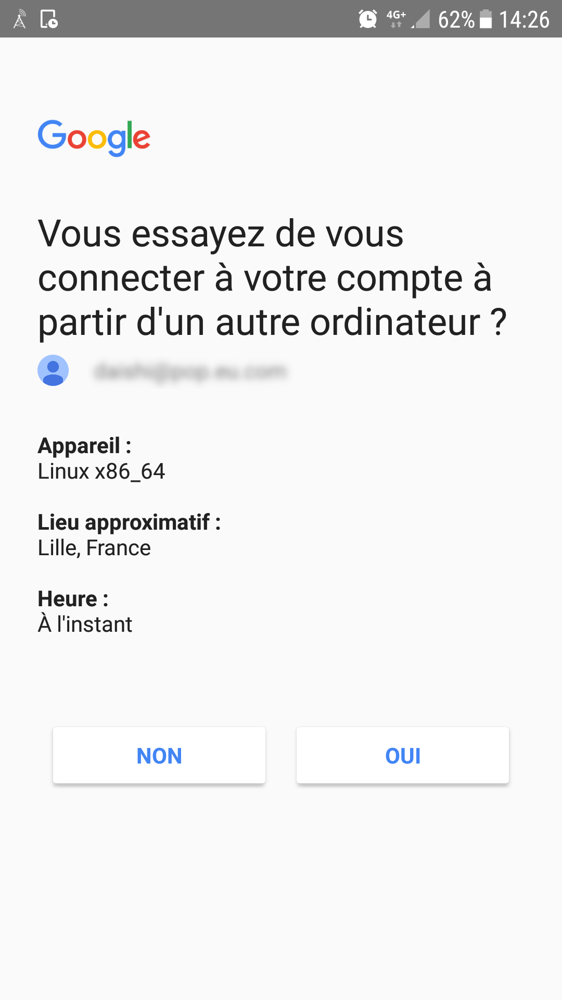
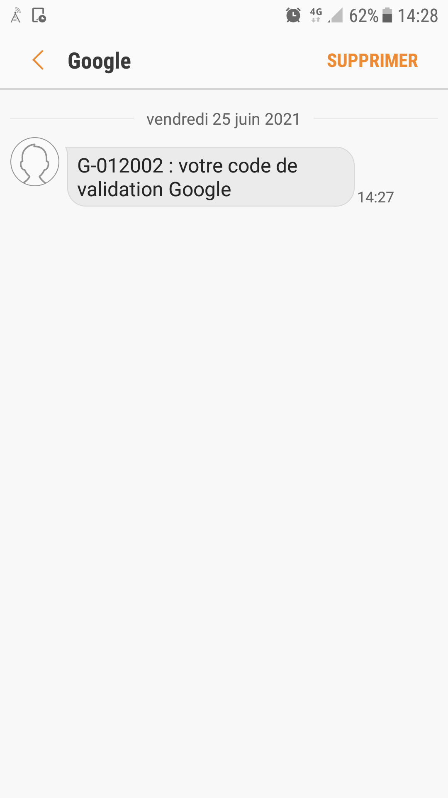
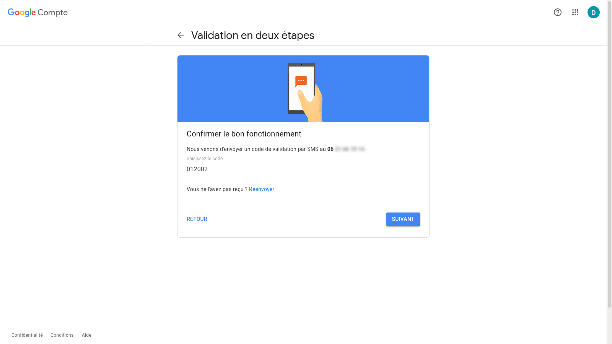
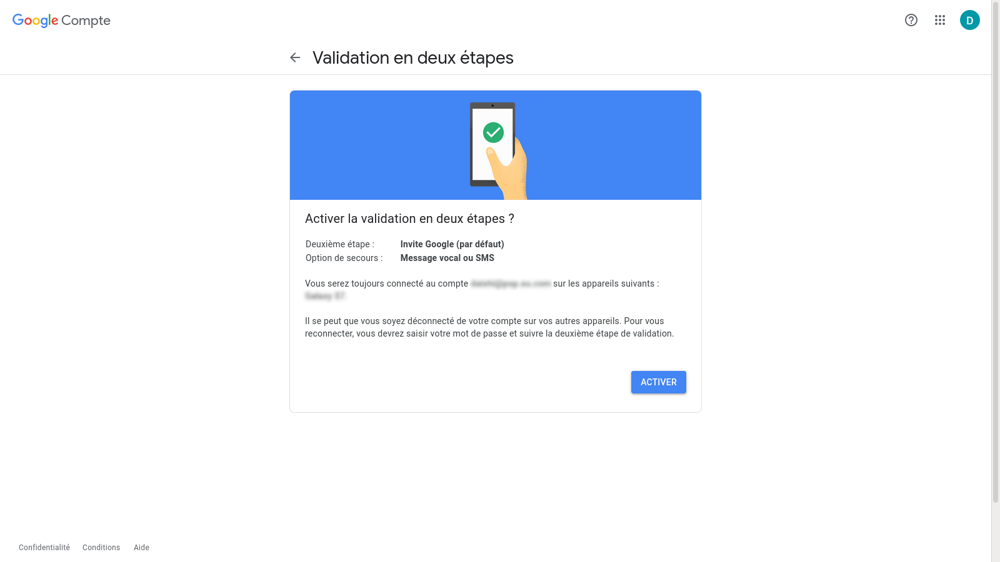
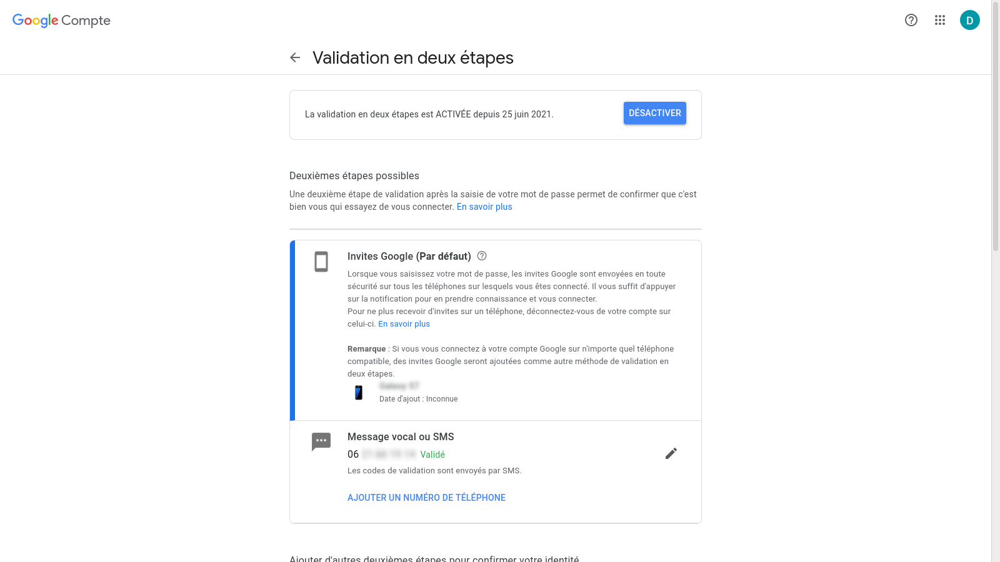
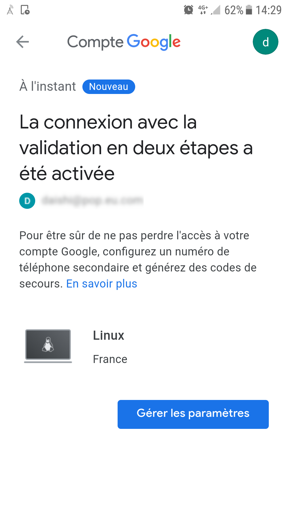

# Google two factor authentication

Cette fiche vous montre comment activer l'authentification à deux
facteurs.

## Les étapes

Rendez-vous dans l'onglet sécurité des paramètres de votre compte
Google : [Compte Google](https://myaccount.google.com/security).

Maintenant suivez les étapes.

Étape 1

Cliquez sur le lien « Validation en deux étapes ».

Étape 2

Étape 3

Étape 4

Étape 5

Étape 6

Étape 7

Étape 8

Étape 9

Étape 10

Étape 11

Étape 12

