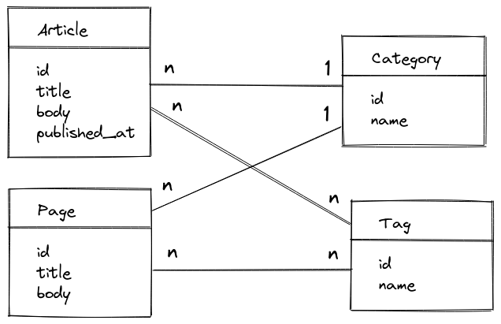
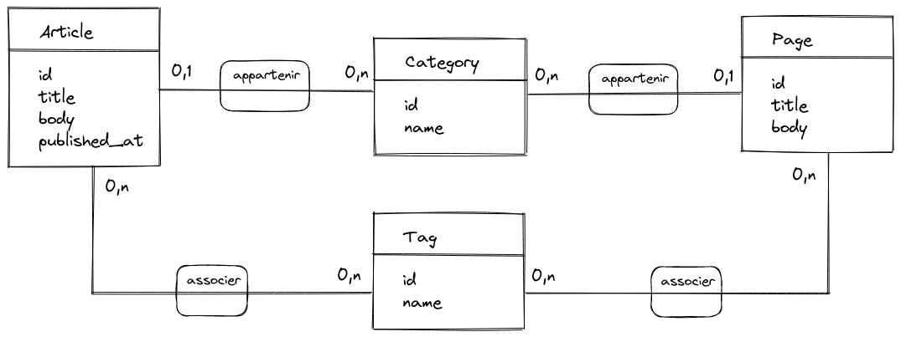

# Projet blog

## Cahier des charges

Un client souhaite mettre en ligne un blog mais refuse d'utiliser un Wordpress pour des raisons de sécurité.
Mais il souhaite avoir des fonctionnalités semblables à celles de Wordpress.

Voici une liste des fonctionnalités souhaitées :

- pour des raisons d'internationalisation, la BDD doit être en anglais
- la publication d'articles (`article`) d'actualité
- la planification de la publication d'un article
- la dépublication d'un article
- la publication de pages (`page`) qui changent peu
- la création de catégories (`category`)
- la création d'étiquettes (`tag`)
- la classification des articles et des pages dans une catégorie
- l'association d'articles et de pages à des étiquettes

## Schéma en UML

Source : [projet-blog-uml.excalidraw](img/projet-blog-uml.excalidraw).
L'image conçue avec [Excalidraw](https://excalidraw.com/).

## Schéma MLD en MERISE

Source : [projet-blog-merise-mld.excalidraw](img/projet-blog-merise-mld.excalidraw).
L'image conçue avec [Excalidraw](https://excalidraw.com/).

