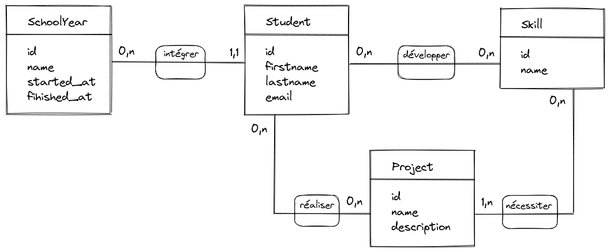

# Projet student

## Cahier des charges

Un client souhaite mettre en ligne une application de gestion de formation.

Voici une liste des fonctionnalités souhaitées :

- pour des raisons d'internationalisation, la BDD doit être en anglais
- la création de promos (`school year`)
- la planification du début et de la fin d'une promo
- la création d'apprenants (`student`)
- la création de compétences (`skill`)
- la création de projets (`project`)
- l'ajout d'apprenants dans une promo
- l'ajout d'apprenants dans plusieurs projets
- l'association d'apprenants et de compétences
- l'association de projets et de compétences

## Schéma en UML

Source : [projet-student-uml.excalidraw](img/projet-student-uml.excalidraw).
L'image conçue avec [Excalidraw](https://excalidraw.com/).

## Schéma MLD en MERISE

Source : [projet-student-merise-mld.excalidraw](img/projet-student-merise-mld.excalidraw).
L'image conçue avec [Excalidraw](https://excalidraw.com/).

