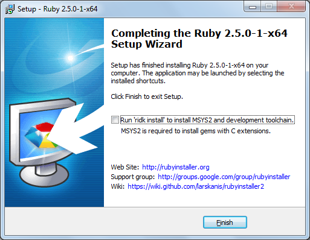

# Ruby

## Installation

Installer :

- [RubyInstaller](https://rubyinstaller.org/downloads/) (seulement pour Windows)

Attention : lors de l'installation de Ruby, éviter d'installer MSYS2. Pour ce faire, décocher la case « Run 'rdk install' to install MSYS2 and development toolchain » (voir screenshot ci-dessous). MSYS2 n'est nécessaire que si l'on installe des packages ruby écrits en C.

