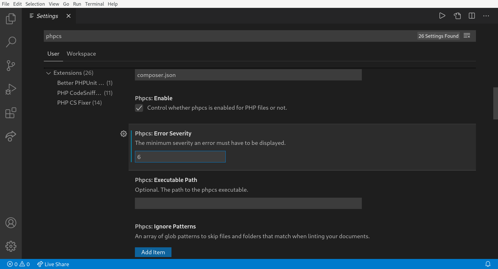
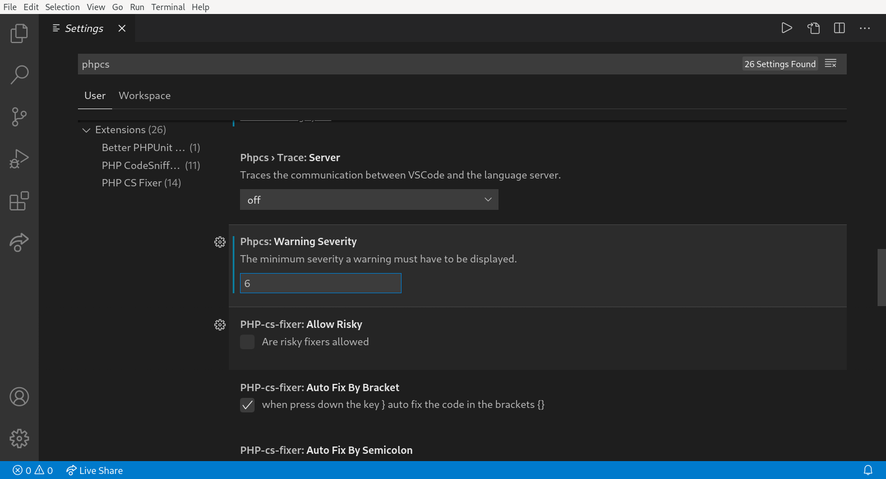
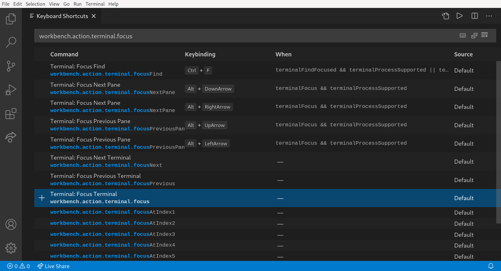
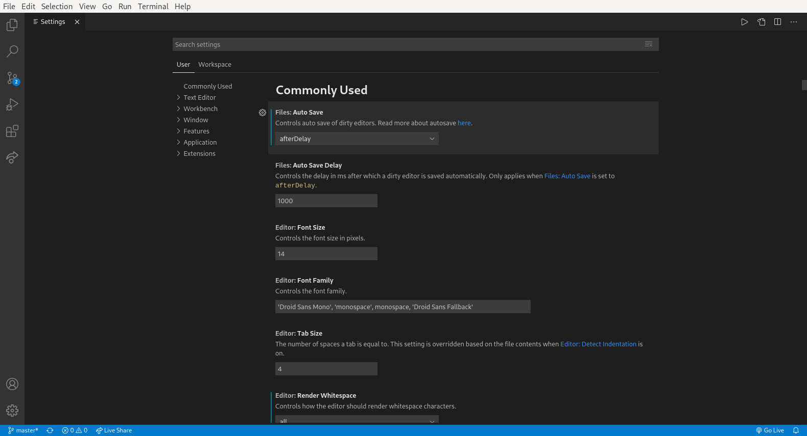
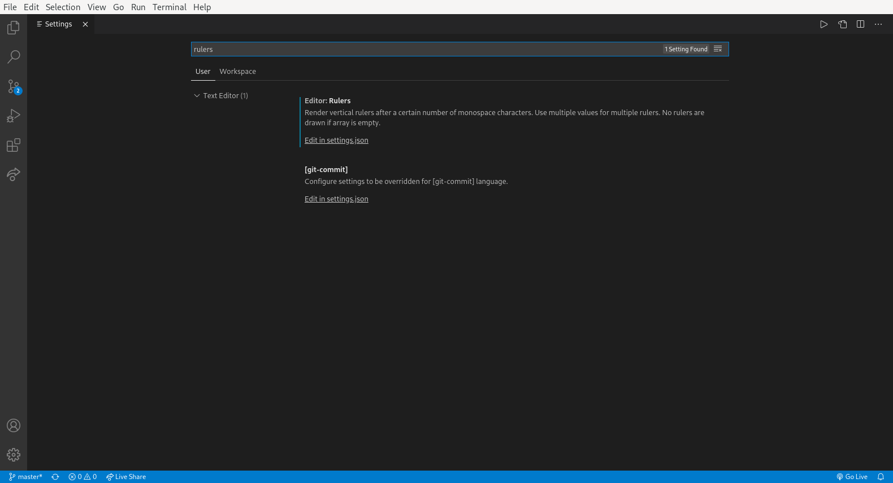
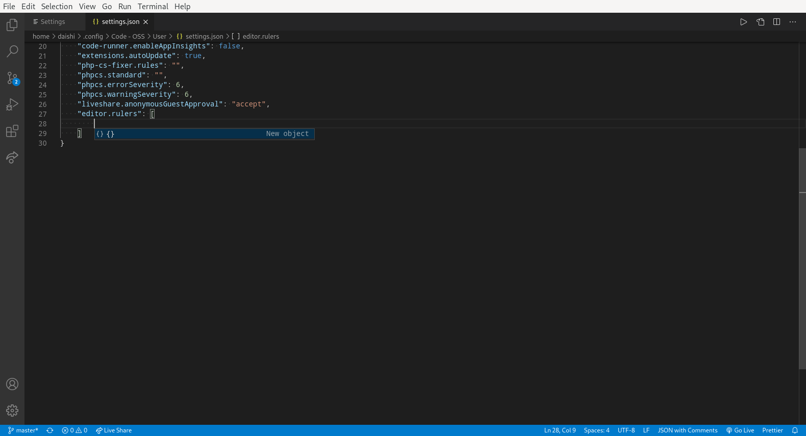
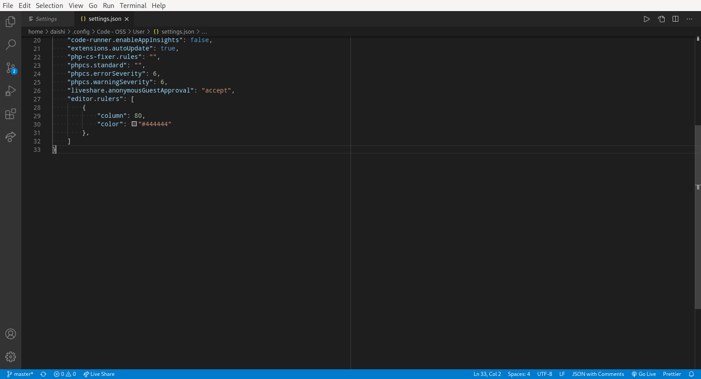
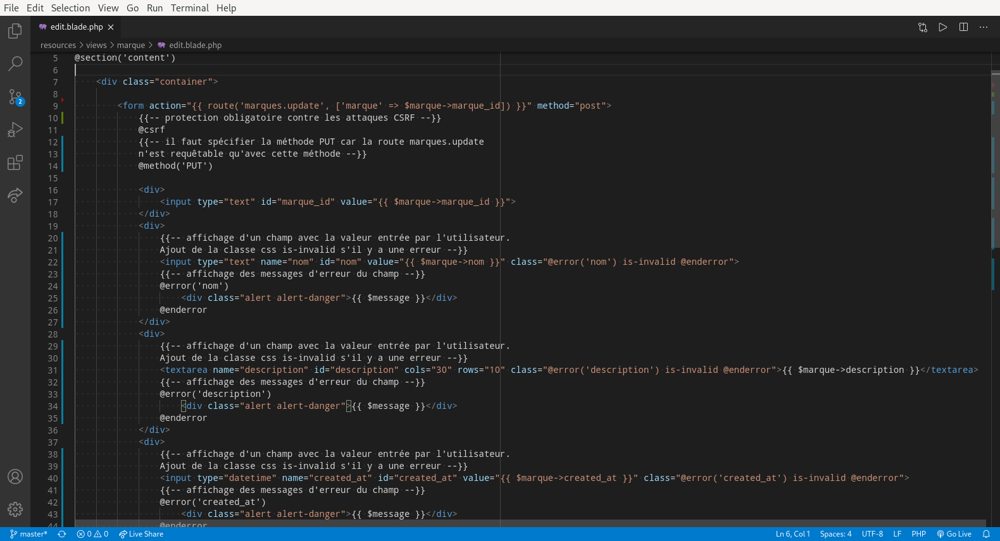

# VSCode

Visual Studio Code (VSCode pour les intimes) est un éditeur de code libre et open source développé par Microsoft.

Vscodium est une version précompilée à partir du code source original de VS Code mais sans les modules de télémétrie et de tracking ajoutés par Microsoft.

## Auto Save

Pour activer l'auto save :

Dans le menu `File` > cochez `Auto Save`

## Données personnelles

Pour désactiver la télémétrie :

Dans le menu `File` > `Preferences` > `Settings` > tapez `telemetry` dans le champ de recherche > décochez `Telemetry: Enable Telemetry` et `Code-runner: Enable App Insights`

## Plugins

Voici quelques plugins recommandés pour faire du développement web en JS, PHP et Python :

- Name: Better PHPUnit  
  Id: calebporzio.better-phpunit  
  Publisher: calebporzio
- Name: Code Runner  
  Id: formulahendry.code-runner  
  Publisher: Jun Han
- Name: DotENV  
  Id: mikestead.dotenv  
  Publisher: mikestead
- Name: ESLint  
  Id: dbaeumer.vscode-eslint  
  Publisher: Dirk Baeumer
- Name: Live Server  
  Id: ritwickdey.liveserver  
  Publisher: Ritwick Dey
- Name: Live Share  
  Id: ms-vsliveshare.vsliveshare  
  Publisher: Microsoft
- Name: php cs fixer  
  Id: junstyle.php-cs-fixer  
  Publisher: junstyle
- Name: PHP Debug  
  Id: felixfbecker.php-debug  
  Publisher: Felix Becker  
  Note: installer XDebug (voir la doc du plugin)
- Name: PHP DocBlocker  
  Id: neilbrayfield.php-docblocker  
  Publisher: Neil Brayfield
- Name: PHP Getters & Setters  
  Id: phproberto.vscode-php-getters-setters  
  Publisher: phproberto
- Name: PHP IntelliSense  
  Id: felixfbecker.php-intellisense  
  Publisher: Felix Becker  
  Note: affecter `false` au paramètre `php.suggest.basic` de vscode
- Name: PHP Namespace Resolver  
  Id: mehedidracula.php-namespace-resolver  
  Publisher: Mehedi Hassan
- Name: phpcs  
  Id: ikappas.phpcs  
  Publisher: Ioannis Kappas  
  Note: `composer global require squizlabs/php_codesniffer`
- Name: Prettier - Code formatter  
  Id: esbenp.prettier-vscode  
  Publisher: Esben Petersen
- Name: Python  
  Id: ms-python.python  
  Publisher: Microsoft
- Name: SFTP  
  Id: liximomo.sftp  
  Publisher: liximomo
- Name: Twig  
  Id: whatwedo.twig  
  Publisher: whatwedo

Vous pouvez copier-coller l'id du plugin dans le champ de recherche pour le trouver avec exactitude.

## Activer la coloration syntaxique du HTML dans les fichiers Twig

1. File
2. Preferences
3. Settings
4. taper `emmet.includeLanguages` dans la barre de recherche
5. Add Item
6. taper `twig` dans le champ Key et `html` dans le champ Value

Vous pouvez fermer l'onglet.

## Le plugin `phpcs` affiche trop d'erreurs et de warnings dans l'onglet `Problems`

Il est possible de réhausser le niveau minimum d'erreurs et de warnings à afficher.

`File` > `Preferences` > `Settings` > `phpcs`

Puis faire passer le niveau du paramètre :

- `Error Severity` de `5` à `6`
- `Warning Severity` de `5` à `6`





## Afficher le terminal avec un raccourci clavier

Personnellement, j'aime bien utiliser la combinaison de touches `CTRL ALT t` mais une autre combinaison de touches est possible.

`File` > `Preferences` > `Keyboard Shortcuts` > `workbench.action.terminal.focus`

Ne vous faites pas avoir, ne changez pas le raccourci clavier d'autres commandes qui ressemblent.
Celle que nous cherchons, c'est :

    Terminal: Focus Terminal
    workbench.action.terminal.focus

Cliquez sur l'icône `+` sur la gauche de la commande, puis choisissez votre raccourci clavier et validez avec `Enter`.



Vous pouvez *resetter* le raccourci clavier en faisant un click droit et en choisissant `Reset Keybinding`.

## Afficher une ligne verticale à la 80ème colonne

Cette ligne vreticale permet d'avoir un repère pour éviter d'écrire des lignes de code trop longues.

Pour afficher cette ligne verticale, ouvrez la fenêtre « Settings » :

`File` > `Preferences` > `Settings`



Tapez le mot clé `rulers` puis cliquez sur le `Edit in settings.json` de la première entrée :



Dans la section `"editor.rulers"`, ajoutez le bloc de code suivant :

    {
        "column": 80,
        "color": #444444
    }

Note : vous pouvez choisir une autre couleur que `#444444`.



Ça devrait ressembler à ceci :



Au final vous devriez voir une ligne verticale à la 80ème colonne dès que vous ouvrez un fichier.



## Quelques conseils de Microsoft

- [JavaScript Programming with Visual Studio Code](https://code.visualstudio.com/Docs/languages/javascript)
- [PHP Programming with Visual Studio Code](https://code.visualstudio.com/docs/languages/php)
- [Python in Visual Studio Code](https://code.visualstudio.com/docs/languages/python)

## Comment utiliser le plugin SFTP

**Dans ce tutoriel nous allons voir comment utiliser VSCode pour travailler en local mais publier et exécuter du code python sur son VPS.**

Prérequis :

- Auto Save (voir ci-dessus)
- OpenSSH (sur le poste de travail)

1. Dans VSCode, installez l'extension suivante :  
  Name: SFTP  
  Id: liximomo.sftp  
  Publisher: liximomo
2. Sur le poste de développement, dans la home de votre utilisateur, créez un dossier `projects` et encore dedans un dossier `python`  
  Par exemple, pour l'utilisateur `foo` : `C:\Users\foo\projects\python`
3. Dans le VPS, faire la même chose : dans la home de votre utilisateur, créez un dossier `projects` et encore dedans un dossier `python`  
  Par exemple, pour l'utilisateur `foo` : `/home/foo/projects/python`
4. Dans VSCode, ouvrez le dossier `python` : `File` > `Open Folder` > ouvrez le dossier `projects` > ouvrez le dossier `python` > validez
5. Dans VSCode, créez la configuration SFTP : appuyez sur la touche `F1` > tapez `sftp: config` > validez
6. Dans le fichier `sftp.json` collez le code suivant :

  ```
  {
    "name": "My Server",
    "host": "123.123.123.123",
    "protocol": "sftp",
    "port": 54321,
    "username": "foo",
    "remotePath": "/home/foo/projects/python",
    "privateKeyPath": "/home/baz/.ssh/id_rsa",
    "agent": "$SSH_AUTH_SOCK",
    "uploadOnSave": true
   }
  ```

  Remplacez les champs suivants par leur vraie valeur :

  - `host` : adresse ip de votre VPS
  - `port` : port SSH
  - `username` : nom d'utilisateur de votre VPS (remplacez `foo` par le nom d'utilisateur de votre VPS)
  - `remotePath` : le nom du dossier où vous voulez copier votre projet dans votre VPS
  - `privateKeyPath` : le chemin du fichier contenant votre clé RSA privée au format Open SSH (remplacez `baz` par le nom du'tilisateur de votre machine locale)  
    Avec Windows, vous devez entrer un chemin du type `"privateKeyPath": "C:\\Users\\baz\\.ssh\\id_rsa",`  
    Avec MacOS, vous devez entrer un chemin du type `"privateKeyPath": "/Users/baz/.ssh/id_rsa",`
  - `agent` : si vous n'utilisez pas MacOS ce paramètre n'est pas nécessaire, vous pouvez l'enlever

7. Dans vscode, ouvrez une connexion SSH : appuyez sur la touche `F1` > tapez `sftp: open ssh in terminal` > validez
8. Dans VSCode, si le terminal vous demande un mot de passe, tapez le mot de passe de l'utilisateur de votre VPS
9. Dans VSCode, le terminal devrait être connecté à votr VPS
10. Dans VSCode, Créer un nouveau fichier nommé `hello.py` et tapez le code suivant :

  ```
  print("Hello World!")
  ```

11. Dans VSCode, depuis le terminal, tapez les commandes suivantes :

  ```
  cd python
  python3 hello.py
  ```

12. Si un message `Hello World!` s'affiche dans le terminal, vous avez réussi !

### Se connecter au VPS sans mot de passe avec Windows

Prérequis :

- PuTTY
- serveur VPS avec authentification par clé

Voici les étapes dans les grandes lignes :

1. On convertit les clé PuTTY en clé Open SSH
2. On créé un config pour SSH
3. On test la connexion

Pour convertir les clé de putty au format Open SSH, vous pouvez suivre les indications suivantes :

1. Sur votre poste de dev, dans la home de votre utilisateur, créez un dossier `.ssh` puis encore dedans un dossier  
  Par exemple, pour l'utilisateur `foo` : `C:\Users\foo\.ssh`
2. Lancez PuTTYGen
3. Chargez la clé RSA privée que vous avez créé avec PuTTYGen (`id_rsa.ppk`)
4. Dans le menu `Conversions` > `Export OpenSSH Key` > sauver le fichier dans le fichier `C:\Users\foo\.ssh\id_rsa.` (oui il y a bien un `.` point à la fin du nom du fichier)  
  **Attention : ce fichier ne doit pas avoir d'extension !**  
  Au besoin renommez-le en utilisant le terminal
5. Copiez en entier le contenu du champ « Public key for pasting into Open SSH authorized_keys file : » (il s'agit de la clé RSA publique)
6. Collez le code dans `notepad` puis enregistrez le résultat dans le fichier `C:\Users\foo\.ssh\id_rsa.pub`
7. Ouvrez un nouveau `notepad` et collez le code suivant :

  ```
  Host host
  	HostName host
  	User username
  	Port port
  	IdentityFile ~/.ssh/id_rsa
  ```

  Remplacez les champs suivants par leur vraie valeur :

    - `host` : adresse ip de votre VPS
    - `port` : port SSH
    - `username` : nom d'utilisateur de votre VPS

8. Enregistrez le résultat dans le fichier `C:\Users\.ssh\config.`  (oui il y a bien un `.` point à la fin du nom du fichier)  
  **Attention : ce fichier ne doit pas avoir d'extension !**  
  Au besoin renommez-le en utilisant le terminal
9. Dans VSCode, testez à nouveau le connexion SSH à votre VPS avec le terminal
10. Si le terminal ne vous demande plus de mot de passe, c'est que vous avez réussi !

## Doc

- [Visual Studio Code - Code Editing. Redefined](https://code.visualstudio.com/)
- [Documentation for Visual Studio Code](https://code.visualstudio.com/docs)
- [Visual Studio Code Frequently Asked Questions](https://code.visualstudio.com/docs/supporting/faq)
- [VSCodium - Open Source Binaries of VSCode](https://vscodium.com/)
- [Visual Studio Code Remote Development Troubleshooting Tips and Tricks](https://code.visualstudio.com/docs/remote/troubleshooting#_reusing-a-key-generated-in-puttygen)

### Amélioration des performances

- [Visual Studio Code User and Workspace Settings](https://code.visualstudio.com/docs/getstarted/settings)
- [visual studio code - why vscode require so much memory? How to make it more clean? - Stack Overflow](https://stackoverflow.com/questions/53658769/why-vscode-require-so-much-memory-how-to-make-it-more-clean)
- [Reducing VSCode Memory Consumption - DEV Community 👩‍💻👨‍💻](https://dev.to/claudiodavi/reducing-vscode-memory-consumption-527k)

### Trouble shooting

#### Problèmes avec live share

Il ne se passe rien quand je click sur « partager » ou « rejoindre ».

- [VS Code x86 - No Sign In and Share Button · Issue #102 · MicrosoftDocs/live-share](https://github.com/MicrosoftDocs/live-share/issues/102)
- [Live share not working · Issue #3297 · MicrosoftDocs/live-share](https://github.com/MicrosoftDocs/live-share/issues/3297)
- [visual studio code - A fatal error was encountered. The library 'hostpolicy.dll' required to execute the application was not found - Stack Overflow](https://stackoverflow.com/questions/60888926/a-fatal-error-was-encountered-the-library-hostpolicy-dll-required-to-execute/67019601#67019601)

