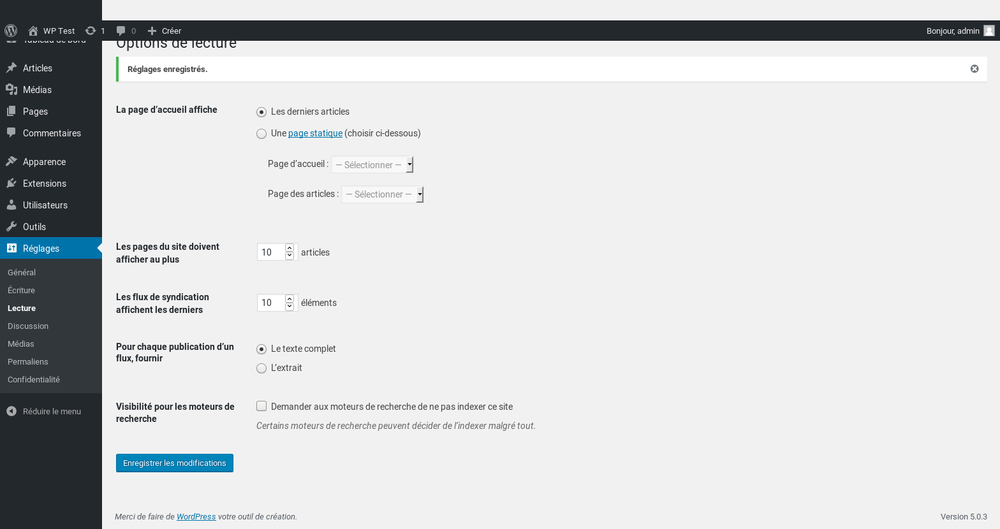
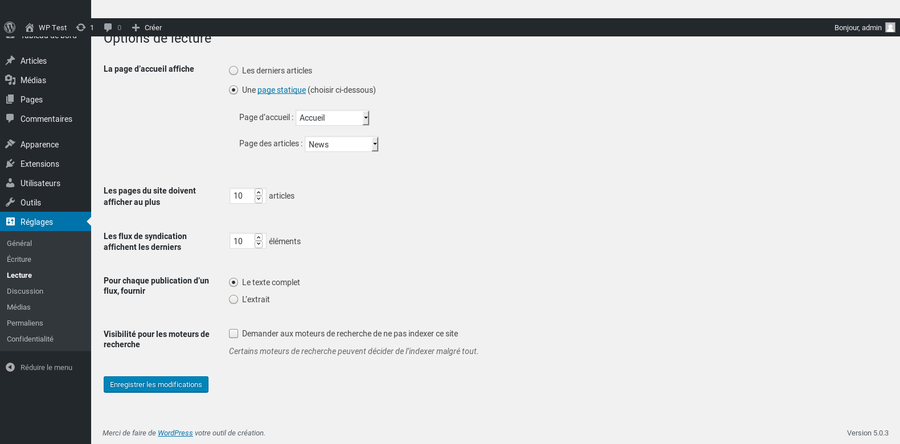
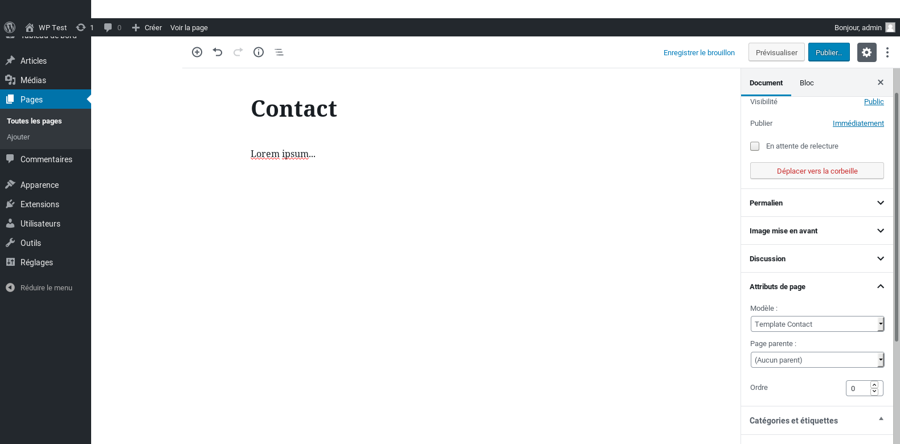

# Wordpress - Développement de thème

Les thèmes se trouvent dans le dossier `wp-content/themes`.
Ils permettent d'habiller différemment la partie front de votre Wordpress.

## Les fichiers d'un thème

Les fichiers doivent être placés dans un sous-dossier du dossier `wp-content/themes`.

Dans notre cas, nous placerons les fichiers dans le sous-dossiers `wp-content/themes/wp-custom-theme`.

### Le minimum requis

Pour créer un thème custom pour Wordpress, il faut au minimum les fichiers suivants :

- `style.css` qui contient les méta données du thème (nom, auteur, url, etc)
- `index.php` qui affiche les pages du site
- (optionnel) `screenshot.png` qui contient une capture d'écran du thème (au format 1200px * 900px)

### Au-delà du minimum

Si on veut un thème custom plus évolué, on peut commencer par rajouter les fichiers suivants :

- `header.php` qui contient l'entête du site (avec la navbar)
- `footer.php` qui contient le pied de page du site
- `functions.php` qui définit les paramètres du thème
- `page.php` qui affiche le contenu de type `page`
- `single.php` qui affiche le contenu de type `post`
- `404.php` qui affiche la page d'erreur 404
- `search.php` qui affiche le résultat d'une recherche

Pour en savoir plus, voir les pages :

- [Organizing Theme Files | Theme Developer Handbook | WordPress Developer Resources](https://developer.wordpress.org/themes/basics/organizing-theme-files/)
- [Template Hierarchy | Theme Developer Handbook | WordPress Developer Resources](https://developer.wordpress.org/themes/basics/template-hierarchy/)

## Le mode de déboggage

Avant de commencer à développer votre thème, il vaut mieux activer le mode de déboggage de Wordpress pour s'assurer que les messages d'erreurs seront visibles à l'écran.

Activez le mode déboggage en place le code suivant dans le fichier `wp-config.php` :

```diff-php
  <?php
  /**
   * The base configuration for WordPress
  ...
   * @link https://wordpress.org/support/article/debugging-in-wordpress/
   */
- define( 'WP_DEBUG', false );
+ // define( 'WP_DEBUG', false );
+ // Force l'affichage des erreurs PHP.
+ @ini_set( 'display_errors', 'On' );
+ // Désactive l'interception des erreurs fatales
+ define( 'WP_DISABLE_FATAL_ERROR_HANDLER', true ); // 5.2 and later
+ // Active le mode de déboggage
+ define( 'WP_DEBUG', true );
+ // Affiche les erreurs de Wordpress
+ define( 'WP_DEBUG_DISPLAY', true );
+ 
  /* Add any custom values between this line and the "stop editing" line. */
```

## Le fichier `style.css`

Ce fichier CSS est absolument nécessaire.

Vous n'êtes pas obligé de stocker vraiment votre feuille de style dedans, mais ce fichier doit au moins contenir les méta-données qui permettent à Wordpress de repérer que le dossier contient un thème Wordpress.

Voici une version minimale :

```css
/*
Theme Name: WP Custom Theme
Version: 1.0.0
Requires at least: 5.0
Requires PHP: 7.0
License: GNU General Public License v2 or later
License URI: http://www.gnu.org/licenses/gpl-2.0.html
Text Domain: wp-custom-theme
*/
```

Et maintenant une version complète :

```css
/*
Theme Name: WP Custom Theme
Theme URI: https://github.com/foo/wp-custom-theme/
Author: Foo
Author URI: https://example.com/
Description: Une description plus moins longue de votre thème
Tags: usage, couleur, style, accessiblité, etc
Version: 1.0.0
Requires at least: 5.0
Tested up to: 5.7.2
Requires PHP: 7.0
License: GNU General Public License v2 or later
License URI: http://www.gnu.org/licenses/gpl-2.0.html
Text Domain: wp-custom-theme
*/
```

Petite explications des tags :

- `Version` : le numéro de version de votre thème
- `Requires at least` : le numéro de version minimal de Wordpress pour faire fonctionner votre thème
- `Tested up to` : le numéro de version maximal de Wordpress avec lequele votre thème a été testé
- `Requires PHP` : le numéro de version de PHP minimal pour faire fonctionner votre thème
- `Text Domain` : c'est le même concept qu'un `namespace` mais pour les traductions ; si plusieurs traductions sont disponibles, elles seront cherchées en prioritées dans le text domain spécifié

En dessous des méta-données, vous pouvez rajouter votre feuille de style si vous le voulez :

```diff-css
  /*
  Theme Name: WP Custom Theme
  ...
  Text Domain: wp-custom-theme
  */
+ 
+ body {
+   background-color: pink;
+ }
```

## Le fichier `index.php`

Comme le fichier CSS, ce fichier PHP est absolument nécessaire.
Sans ce fichier, Wordpress ne reconnaîtra pas que le dossier est un thème Wordpress.

Insérez le code de la boucle dans votre `index.php` :

```php
<?php

// Affichage de la liste des articles avec la boucle
if ( have_posts() ):
    while (have_posts()):
        the_post();
        ?>
        <article>
            <h2><?php the_title(); ?></h2>
            <div><?php the_content(); ?></div>
        </article>
        <?php
    endwhile;
endif;
```

Si vous ouvrez la home de votre site, vous verrez l'article par défaut « Hello world! » s'afficher.
Mais en regardant le code source de la page, horreur !, vous verrez que la balise `article` se ballade toute seule sans être insérée dans un document HTML.

## Les fichiers d'entête et de pied de page

Notre thème a besoin d'un fichier d'entête et de pied de page pour afficher des documents HTML valides.

Ajoutez un fichier `header.php` :

```php
<!DOCTYPE html>
<html lang="<?php bloginfo( 'language' ); ?>">
<head>
    <meta charset="<?php bloginfo( 'charset' ); ?>" />
    <meta name="viewport" content="width=device-width, initial-scale=1, shrink-to-fit=no">
    <meta http-equiv="X-UA-Compatible" content="ie=edge" />
    <?php
    if (is_front_page()):
        ?>
        <title>Accueil | <?php bloginfo( 'name' ); ?></title>
        <?php
    else:
        ?>
        <title><?php wp_title(); ?> | <?php bloginfo( 'name' ); ?></title>
        <?php
    endif;
    ?>
    <link rel="shortcut icon" type="image/png" href="<?= get_stylesheet_directory_uri(); ?>/img/icons8-bulle.svg" />
    <link rel="pingback" href="<?php bloginfo( 'pingback_url' ); ?>" />
    <?php wp_head(); ?>
</head>
<body <?php body_class(); ?>>
```

Ce header est dynamique car Wordpress va remplacer le contenu des blocs PHP par les vraies données.

Et un fichier `footer.php` :

```php
<?php wp_footer(); ?>
</body>
</html>
```

Et maintenant modifiez votre fichier `index.php` pour qu'il utilise ces fichiers :

```diff-php
+ get_header();
+ 
  if ( have_posts() ):
      while (have_posts()):
      // ...
      endwhile;
  endif;
+ 
+ get_footer();
```

Si vous rechargez la home de votre site, vous verrez que le code source affiche un document HTML complet.

## Le fichier `functions.php`

Ce fichier permet de :

- intégrer des packages installés avec composer
- ajouter des paramètres de sécurité
- ajouter des paramètres de localisation
- contrôler les fichiers CSS et les fichiers JS que le thème va charger
- déclarer des fonctionnalités spéciales dans le thème

Voici un fichier `functions.php` minimaliste :

```php
<?php

/**
 * composer
 */

// chargement de l'autoloading de composer
require get_template_directory().'/vendor/autoload.php';

/**
 * sécurité
 */

// désactive l'édition de fichier dans l'admin
define( 'DISALLOW_FILE_EDIT', true );

/**
 * localisation
 */

// choix du fuseau horaire
date_default_timezone_set( 'Europe/Paris' );
// choix du réglage régional
setlocale( LC_ALL, 'fr', 'fr_FR', 'fr_FR.utf8', 'fr_FR.ISO_8859-1' );

/**
 * CSS
 */

// cette fonction se charge d'intégrer les feuilles de style du thème
function my_theme_enqueue_styles() {
    // affiche la liste des feuilles de style qui seront chargées
    // $wp_styles = wp_styles();
    // var_dump($wp_styles->queue);
    // affiche des infos détaillées sur chaque feuille de style
    // foreach( $wp_styles->queue as $handle ) {
    //     var_dump($wp_styles->registered[$handle]);
    // }

    // chargement d'un fichier CSS
    wp_enqueue_style( 'my-theme-main', get_stylesheet_directory_uri().'/css/main.css', [] );
}

// demande à Wordpress de lancer la fonction `my_theme_enqueue_styles` durant le démarrage de l'application
// PHP_INT_MAX est le niveau de priorité, plus ce nombre est grand et moins la priorité est élevée
// le niveau de priorité par défaut est 10
add_action( 'wp_enqueue_scripts', 'my_theme_enqueue_styles', PHP_INT_MAX );

/**
 * JS
 */

// cette fonction se charge d'intégrer les scripts JS du thème
function my_theme_enqueue_scripts() {
    // affiche la liste des scripts qui seront chargées
    // $wp_scripts = wp_scripts();
    // var_dump($wp_scripts->queue);
    // affiche des infos détaillées sur chaque script
    // foreach( $wp_scripts->queue as $handle ) {
    //     var_dump($wp_scripts->registered[$handle]);
    // }

    // chargement d'un fichier JS
    wp_enqueue_script( 'my-theme-main', get_stylesheet_directory_uri().'/js/main.js', [] );
}

// demande à Wordpress de lancer la fonction `my_theme_enqueue_scripts` durant le démarrage de l'application
// PHP_INT_MAX est le niveau de priorité, plus ce nombre est grand et moins la priorité est élevée
// le niveau de priorité par défaut est 10
add_action( 'wp_enqueue_scripts', 'my_theme_enqueue_scripts', PHP_INT_MAX );

/**
 * fonctionnalités du thème
 */

// activation de la fonctionnalité des balises HTML5
add_theme_support( 'html5' );
// activation de la fonctionnalité du titre du site
add_theme_support( 'title-tag' );
// activation de la fonctionnalité des vignettes
add_theme_support( 'post-thumbnails' );
```

Si vous voulez charger des fichiers CSS ou JS depuis un autre nom de domaine c'est tout à fait possible.

Voici un exemple qui montre comment charger Bootstrap depuis un CDN :

```diff-php
  /**
   * CSS
   */
  
  // cette fonction se charge d'intégrer les feuilles de style du thème
  function my_theme_enqueue_styles() {
      // affiche la liste des feuilles de style qui seront chargées
      // $wp_styles = wp_styles();
      // var_dump($wp_styles->queue);
      // affiche des infos détaillées sur chaque feuille de style
      // foreach( $wp_styles->queue as $handle ) {
      //     var_dump($wp_styles->registered[$handle]);
      // }

+     // chargement de Bootstrap
+     wp_enqueue_style( 'bootstrap', 'https://cdn.jsdelivr.net/npm/bootstrap@5.0.2/dist/css/bootstrap.min.css', [] );
+ 
      // chargement d'un fichier CSS
-     wp_enqueue_style( 'my-theme-main', get_stylesheet_directory_uri().'/css/main.css', [] );
+     wp_enqueue_style( 'my-theme-main', get_stylesheet_directory_uri().'/css/main.css', ['bootstrap'] );
  }

  // demande à Wordpress de lancer la fonction `my_theme_enqueue_styles` durant le démarrage de l'application
  // PHP_INT_MAX est le niveau de priorité, plus ce nombre est grand et moins la priorité est élevée
  // le niveau de priorité par défaut est 10
  add_action( 'wp_enqueue_scripts', 'my_theme_enqueue_styles', PHP_INT_MAX );
  
  /**
   * JS
   */
  
  // cette fonction se charge d'intégrer les scripts JS du thème
  function my_theme_enqueue_scripts() {
      // affiche la liste des scripts qui seront chargées
      // $wp_scripts = wp_scripts();
      // var_dump($wp_scripts->queue);
      // affiche des infos détaillées sur chaque script
      // foreach( $wp_scripts->queue as $handle ) {
      //     var_dump($wp_scripts->registered[$handle]);
      // }

+     // chargement de Bootstrap
+     wp_enqueue_script( 'my-theme-main', 'https://cdn.jsdelivr.net/npm/bootstrap@5.0.2/dist/js/bootstrap.bundle.min.js', [] );
+ 
      // chargement d'un fichier JS
-     wp_enqueue_script( 'my-theme-main', get_stylesheet_directory_uri().'/js/main.js', [] );
+     wp_enqueue_script( 'my-theme-main', get_stylesheet_directory_uri().'/js/main.js', ['bootstrap'] );
  }

  // demande à Wordpress de lancer la fonction `my_theme_enqueue_scripts` durant le démarrage de l'application
  // PHP_INT_MAX est le niveau de priorité, plus ce nombre est grand et moins la priorité est élevée
  // le niveau de priorité par défaut est 10
  add_action( 'wp_enqueue_scripts', 'my_theme_enqueue_scripts', PHP_INT_MAX );
```

Dans les fonctions `wp_enqueue_style()` et `wp_enqueue_script()`, le premier paramètre permet de donner un alias à la resource (c-à-d le fichier CSS ou JS) que l'on veut charger.
Cela permet de spcécifier dans le troisième paramètre (un tableau vide `[]` par défaut) une liste de resources qui sont des dépendances.

Concrètement, le fait d'avoir `['foo']` comme troisième paramètre vous assure que la resource que vous voulez charger sera chargée **après** la resource `'foo'`.
Comme c'est un tableau, vous pouvez spécifier plusieurs ressources, par exemple `['bootstrap', 'fontawesome']`.

## Une page d'accueil personnalisée

Par défaut, la page d'accueil de Wordpress affiche la liste des articles.
Autrement dit, quand on appel l'URL `http://example.com/`, Wordpress utilise le fichier `index.php` pour afficher le contenu de la page.

Mais il est possible de modifier ce réglage par défaut :



### Exemple avec une page d'accueil statique et une page de news

Imaginons que nous voulons afficher :

- une page d'accueil statique (avec toujours les mêmes infos)
- un fil d'actus sur une autre page, avec du contenu statique en début de page

Pour faire cela, il faut :

- créer une page nommée « Accueil »
- créer une autre page nommée « Actus »
- créer un fichier nommé `front-page.php`
- créer un fichier nommé `home.php`
- configurer les permaliens pour qu'ils utilisent les slugs dans les paramètres du backoffice
- configurer la page d'accueil et la page des articles de Wordpress dans les paramètres du backoffice

La page d'accueil affichera le contenu de la page « Accueil ».
La page « Actus » affichera d'abord le contenu de la page « Actus » puis la liste de articles.
La page « Actus » aurait pu s'appeler Foo, cela n'aurait rien changé, elle aurait tout de même affiché la liste des actus.

Voici un contenu possible du fichier `front-page.php` :

```php
<?php

get_header();

// Affichage de la page d'accueil sans la boucle
if ( have_posts() ):
    the_post();
    ?>
    <article>
        <h1><?php the_title(); ?></h1>
        <div><?php the_content(); ?></div>
    </article>
    <?php
endif;

get_footer();
```

Voici un contenu possible du fichier `home.php` :

```php
<?php

get_header();

// Afichage de la page actus

// Les paramètres de la requête WP_QUery
$args = array(
    // Sélection de pages (au lieu de posts)
    'post_type' => 'page',
    // Sélection d'une page par son slug
    'pagename' => 'actus',
);

// Exécution de la requête WP_Query
$query = new WP_Query( $args );

// Affichage du résultat de la requête WP_Query sans la boucle
if ( $query->have_posts() ):
    $query->the_post();
    ?>
    <article>
        <h1><?php the_title(); ?></h1>
        <div><?php the_content(); ?></div>
    </article>
    <?php
endif;

// Restauration des paramètres originaux de la requête de l'utilisateur
wp_reset_postdata();

// Affichage de la liste des articles avec la boucle
if ( have_posts() ):
    while (have_posts()):
        the_post();
        ?>
        <article>
            <?php // Notez que le titre est dans un lien clickable ?>
            <h2><a href="<?= get_permalink(); ?>"><?php the_title(); ?></a></h2>
            <div><?php the_content(); ?></div>
        </article>
        <?php
    endwhile;
endif;

get_footer();
```

Maintenant, il faut changer les paramètres de Wordpress :

- aller dans la page **Admin > Réglages > Lecture**
- choisir l'option **Une page statique**
- sélectionner « Accueil » comme page d'accueil et « Actus » comme page des articles
- enregistrer les modifications



## Afficher la date de publication d'un article

```diff-php
      <article>
          <h1><?php the_title(); ?></h1>
+         <div><?php the_time( get_option( 'date_format' ) ); ?></div>
          <div><?php the_content(); ?></div>
      </article>
```


## Afficher la vignette d'un article

Pour afficher la vignette d'un article, il faut d'abord s'assurer que le thème a bien activé la fonctionnalité avec `add_theme_support( 'post-thumbnails' );` dans le fichier `functions.php`.

Si vous voulez afficher la vignette dans un article, elle ne doit pas être clickable :

```diff-php
      <article>
          <h1><?php the_title(); ?></h1>
          <div><?php the_time( get_option( 'date_format' ) ); ?></div>
+         <?php
+         if ( has_post_thumbnail() ):
+             the_post_thumbnail( 'medium' );
+         endif;
+         ?>
          <div><?php the_content(); ?></div>
      </article>
```

Mais si vous voulez afficher la vignette dans une boucle, il vaut mieux la rendre clickable :

```diff-php
          <article>
              <?php // Notez que le titre est dans un lien clickable ?>
              <h2><a href="<?= get_permalink(); ?>"><?php the_title(); ?></a></h2>
              <div><?php the_time( get_option( 'date_format' ) ); ?></div>
+             <?php
+             if ( has_post_thumbnail() ):
+                 ?>
+                 <a href="<?php the_permalink(); ?>" alt="<?php the_title_attribute(); ?>">
+                     <?php the_post_thumbnail( 'medium' ); ?>
+                 </a>
+                 <?php
+             endif;
+             ?>
              <div><?php the_content(); ?></div>
          </article>
```

**Attention : notez qu'avec les réglages par défaut, les pages n'ont pas vignettes.**

## Les templates de page et d'article

Une page et un article se différencient pour ces raisons :

- une page ne peut pas avoir d'étiquettes (des tags)
- une page ne peut pas avoir de catégorie
- une page ne peut pas avoir de vignette
- en général la date de publication d'une page n'est pas une information intéressante

Sachant cela, on peut partir du fichier `index.php` pour créer dans le fichier `single.php` le template d'un article :

```php
<?php

get_header();

// Affichage d'un article sans la boucle
if ( have_posts() ):
    the_post();
    ?>
    <article>
        <h1><?php the_title(); ?></h1>
        <div><?php the_time( get_option( 'date_format' ) ); ?></div>
        <?php
        if ( has_post_thumbnail() ):
            the_post_thumbnail( 'medium' );
        endif;
        ?>
        <div><?php the_content(); ?></div>
    </article>
    <?php
endif;

get_footer();
```

Et on peut faire pareil dans le fichier `page.php` pour le template d'une page, mais en enlevant la date et la vignette :

```php
<?php

get_header();

// Affichage d'une page sans la boucle
if ( have_posts() ):
    the_post();
    ?>
    <article>
        <h1><?php the_title(); ?></h1>
        <div><?php the_content(); ?></div>
    </article>
    <?php
endif;

get_footer();
```

Quand vous avez fait ça, il y a un dernière chose à faire en complément : adapter le fichier `index.php`.
À cause des fichiers de template que vous avez rajouté, le fichier `index.php` ne sera appelé que si vous demandez des posts en passant par des meta-données (les catégories, les étiquettes, l'auteur, la date, etc).

On va pouvoir afficher un titre généré par Wordpress en fonction du contexte de la requête et corriger la balise `h1` qui n'était pas adaptée dans la liste des articles :

```php
  <?php

  get_header();
  
+ the_archive_title( '<h1>', '</h1>' );
+ 
  if ( have_posts() ):
      while (have_posts()):
          the_post();
          ?>
          <article>
-             <h1><?php the_title(); ?></h1>
+             <h2><?php the_title(); ?></h2>
              <div><?php the_time( get_option( 'date_format' ) ); ?></div>
              <?php
              if ( has_post_thumbnail() ):
                  the_post_thumbnail( 'medium' );
              endif;
              ?>
              <div><?php the_content(); ?></div>
          </article>
          <?php
      endwhile;
  endif;
  
  get_footer();
```

## L'API des thèmes Wordpress

Vous trouverez une liste complète des fonctions que vous pouvez appeler pour récupérer des données dans cette page : [List of Template Tags | Theme Developer Handbook | WordPress Developer Resources](https://developer.wordpress.org/themes/references/list-of-template-tags/).

Pour savoir dans quel contexte le template s'affiche, on peut utiliser des « fonctions conditionnelles ».
Vous trouverez la liste complète de ces fonctions dans cette page : [List of Conditional Tags | Theme Developer Handbook | WordPress Developer Resources](https://developer.wordpress.org/themes/references/list-of-conditional-tags/).

## Créer un template de page

Un template de page permet d'afficher un type de page avec une apparence différente des autres.
Normalement, quand on veut visualiser une page (`http://example.com/contact` par exemple), c'est le fichier `page.php` qui est utilisé pour afficher le document.
Mais si l'on définit un template de page, c'est le fichier contenant ce template (`template-contact.php` par exemple) qui sera utilisé pour l'affichage.

Pour créer un template de page, il suffit d'ajouter contenant un bloc de commentaire dans le fichier.

Exemple de template pour la page « Contact » :

```php
<?php
/**
 * Template Name: Template Contact
 */
```

C'est ce commentaire, et rien d'autre, qui notifie à Wordpress l'existence d'un template de page.

Lors de l'édition d'une page dans l'admin de Wordpress, ce template sera affiché comme étant `Template Contact` dans la section **Attributs de page** dans la colonne de droite :



Il est d'usage de nommer les templates de page avec le préfixe `template-` et d'ajouter le nom de la page le nom du type de page.
Par exemple, pour la page contact, le fichier devrait être nommé `template-contact.php`.

Le reste du contenu du fichier PHP obéit aux règles habituelle d'un fichier de thème Wordpress.
On peut utiliser la boucle pour afficher la page demandée ou utiliser `WP_Query()` pour afficher tout type de contenu.

## La classe `WP_Query`

Afficher tous les articles (`post`) :

```php
<?php

// ...

// Les paramètres de la requête WP_QUery
$args = array(
    'post_type' => array( 'post' ),
);

// Exécution de la requête WP_Query
$query = new WP_Query( $args );

// Affichage du résultat de la requête WP_Query avec la boucle
if ( $query->have_posts() ):
    while ( $query->have_posts() ):
        $query->the_post();
        ?>
        <article>
            <h1><?php the_title(); ?></h1>
            <div><?php the_content(); ?></div>
        </article>
        <?php
    endwhile;
else:
    ?>
    <p>
        Aucun article trouvé
    </p>
    <?php
endif;

// Restauration des paramètres originaux de la requête de l'utilisateur
wp_reset_postdata();
```

Afficher toutes les pages (`page`) :

```php
<?php

// ...

// Les paramètres de la requête WP_QUery
$args = array(
    'post_type' => array( 'page' ),
);

// Exécution de la requête WP_Query
$query = new WP_Query( $args );

// Affichage du résultat de la requête WP_Query avec la boucle
if ( $query->have_posts() ):
    while ( $query->have_posts() ):
        $query->the_post();
        ?>
        <article>
            <h1><?php the_title(); ?></h1>
            <div><?php the_content(); ?></div>
        </article>
        <?php
    endwhile;
else:
    ?>
    <p>
        Aucune page trouvée
    </p>
    <?php
endif;

// Restauration des paramètres originaux de la requête de l'utilisateur
wp_reset_postdata();
```

Afficher un article (`post`) correspondant à un slug donné :

```php
<?php

// ...

// Les paramètres de la requête WP_QUery
$args = array(
    'name' => 'foo',
);

// Exécution de la requête WP_Query
$query = new WP_Query( $args );

// Affichage du résultat de la requête WP_Query sans la boucle
if ( $query->have_posts() ):
    $query->the_post();
    ?>
    <article>
        <h1><?php the_title(); ?></h1>
        <div><?php the_content(); ?></div>
    </article>
    <?php
endif;

// Restauration des paramètres originaux de la requête de l'utilisateur
wp_reset_postdata();
```

Afficher une page (`page`) correspondant à un slug donné :

```php
<?php

// ...

// Les paramètres de la requête WP_QUery
$args = array(
    'pagename' => 'foo',
    'post_type' => array( 'post' ),
);

// Exécution de la requête WP_Query
$query = new WP_Query( $args );

// Affichage du résultat de la requête WP_Query sans la boucle
if ( $query->have_posts() ):
    $query->the_post();
    ?>
    <article>
        <h1><?php the_title(); ?></h1>
        <div><?php the_content(); ?></div>
    </article>
    <?php
endif;

// Restauration des paramètres originaux de la requête de l'utilisateur
wp_reset_postdata();
```

**Attention : vérifiez que votre document possède bien le slug que vous avez spécifié.
Ce slug peut changer si vous changer le mode de création des permaliens dans le backoffice.**

@todo autres sujets avancés :

## Créer un custom post type et l'afficher

1. Créer le custom post type
2. Activer la page d'archive pour ce custom post type
3. Créer le fichier `archive-$posttype.php`
4. Créer le fichier `single-$posttype.php`

## Références

La bible du développeur de thème Wordpress (la doc officielle) :

- [Theme Developer Handbook | WordPress Developer Resources](https://developer.wordpress.org/themes/)

Les fichiers :

- [Organizing Theme Files | Theme Developer Handbook | WordPress Developer Resources](https://developer.wordpress.org/themes/basics/organizing-theme-files/)
- [Template Hierarchy | Theme Developer Handbook | WordPress Developer Resources](https://developer.wordpress.org/themes/basics/template-hierarchy/)

Le déboggage :

- [Debugging in WordPress | WordPress.org](https://wordpress.org/support/article/debugging-in-wordpress/)
- [WP_DISABLE_FATAL_ERROR_HANDLER vs WP_DEBUG ? What to use and when to use to see errors? - WordPress Development Stack Exchange](https://wordpress.stackexchange.com/questions/340062/wp-disable-fatal-error-handler-vs-wp-debug-what-to-use-and-when-to-use-to-see)

Le fichier `style.css` :

- [Main Stylesheet (style.css) | Theme Developer Handbook | WordPress Developer Resources](https://developer.wordpress.org/themes/basics/main-stylesheet-style-css/)

Les fichiers CSS et JS :

- [Including CSS & JavaScript | Theme Developer Handbook | WordPress Developer Resources](https://developer.wordpress.org/themes/basics/including-css-javascript/)
- [JavaScript Best Practices | Theme Developer Handbook | WordPress Developer Resources](https://developer.wordpress.org/themes/advanced-topics/javascript-best-practices/)

La boucle :

- [https://developer.wordpress.org/themes/basics/the-loop/](https://developer.wordpress.org/themes/basics/the-loop/)

La class `WP_Query` :

- [Class Reference/WP Query « WordPress Codex](https://codex.wordpress.org/Class_Reference/WP_Query)

@todo autres sujets avancés :

- [Conditional Tags « WordPress Codex](https://codex.wordpress.org/Conditional_Tags)
- [Shortcode API « WordPress Codex](https://codex.wordpress.org/Shortcode_API)
- [Function Reference/get the tag list « WordPress Codex](https://codex.wordpress.org/Function_Reference/get_the_tag_list)
- [Function Reference/get the category list « WordPress Codex](https://codex.wordpress.org/Function_Reference/get_the_category_list)
- [Post Types « WordPress Codex](https://codex.wordpress.org/Post_Types)
- [Custom Fields « WordPress Codex](https://codex.wordpress.org/Custom_Fields)

## Tutoriels

- [How to Build a WordPress Theme from Scratch: the Basics - SitePoint](https://www.sitepoint.com/build-wordpress-theme-from-scratch-basics/)

